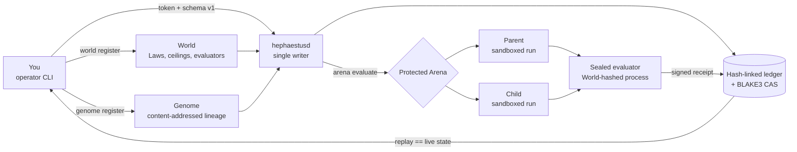
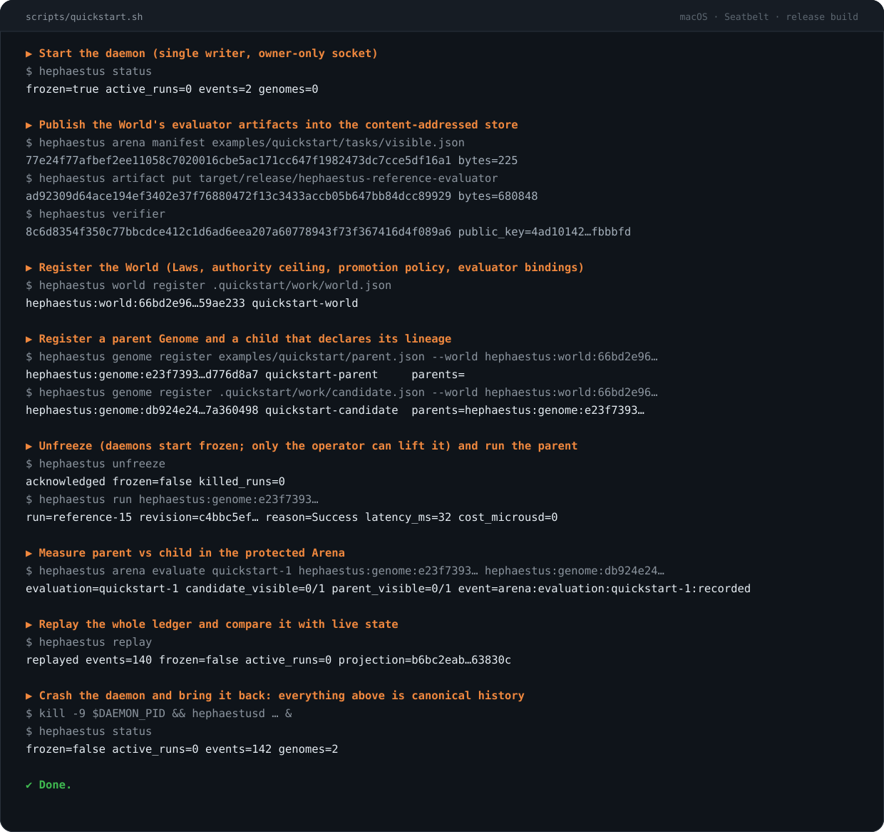

<p align="center">
  
</p>

<h1 align="center">Hephaestus</h1>

<p align="center">
  <em>An evidence-first control plane for evolving AI agents. Every claim of improvement has a receipt.</em>
</p>

<p align="center">
  <a href="https://github.com/randyren278/hephaestus/actions/workflows/ci.yml"></a>
  
  
  
</p>

<p align="center">
  <a href="#quickstart">Quickstart</a> ·
  <a href="#what-it-does">What it does</a> ·
  <a href="#daily-use">Daily use</a> ·
  <a href="#why-you-can-trust-it">Why you can trust it</a> ·
  <a href="docs/ARCHITECTURE.md">Architecture</a>
</p>

Most "self-improving agent" loops keep score by vibes. A model rewrites its own
prompt, a benchmark number goes up, and nobody can say afterwards which change
caused it, whether the candidate peeked at the answer key, or how to get the old
version back.

Hephaestus is the boring, stubborn part of that loop done properly. An agent
configuration is an immutable, content-addressed **Genome**. The environment it
is judged in is an immutable **World** with non-evolvable **Laws**. Parent and
child run in separately sandboxed worktrees under one pinned source revision,
are scored by an evaluator the candidate can never read, and the result lands in
a hash-linked ledger signed by the daemon. Kill the daemon, restart it, and it
rebuilds the exact same state from history or refuses to start.

Named for the god who forged things that lasted. Protected Arena evaluation
and deterministic measured selection are available; trusted invariant checks
and promotion authorization remain separate work.

---

## How it fits together



Candidates never see canonical storage, the evaluator, expected outputs, or
each other. The daemon starts **frozen**; only the operator can unfreeze it,
and that decision is itself a ledgered event.

## What it does

<table>
<tr>
<td width="34%" valign="top"><strong>Compiles Genomes and Worlds into immutable identities</strong></td>
<td valign="top">JSON or YAML in, canonical content-addressed objects out. Two equivalent sources get one identity. A child that claims more authority than its parent or its World is refused at compile time, with the reason.</td>
</tr>
<tr>
<td valign="top"><strong>Registers them through one trusted projection</strong></td>
<td valign="top"><code>hephaestus world register</code> and <code>hephaestus genome register</code> append <code>world.registered</code> / <code>genome.registered</code> events. Every startup replays them strictly: a Genome before its World, a parent under another World, a tampered payload, or a non-canonical artifact fails the boot rather than producing a broken state.</td>
</tr>
<tr>
<td valign="top"><strong>Runs a Genome in isolation</strong></td>
<td valign="top"><code>hephaestus run</code> materializes a private Git worktree at a pinned commit, executes the offline reference runtime under a deny-by-default Seatbelt profile with hard wall and output limits, records redacted lifecycle traces, and signs the terminal result.</td>
</tr>
<tr>
<td valign="top"><strong>Measures parent against child in a protected Arena</strong></td>
<td valign="top"><code>hephaestus arena evaluate</code> loads the World's visible and sealed task manifests itself, pins one revision, seed, environment, and budget for both trials, verifies the deployed evaluator's hash against the World before spending any work, and returns only visible aggregates. A crashed trial is recorded as unreliable and incorrect, with its cost and latency, not dropped.</td>
</tr>
<tr>
<td valign="top"><strong>Records deterministic measured selection</strong></td>
<td valign="top"><code>hephaestus arena select &lt;evaluation-id&gt;</code> recomputes a seeded bootstrap and correctness/reliability/cost/latency gates from verified Arena evidence, then stores an event-bound, hash-addressed receipt. Its invariant gate is explicitly unverified, so it never authorizes promotion.</td>
</tr>
<tr>
<td valign="top"><strong>Proves its own state</strong></td>
<td valign="top"><code>hephaestus replay</code> reloads the ledger from disk, verifies its hash chain, registrations, recorded selections, and projected state, then compares the result with the live daemon. Mismatch is an error, not a warning.</td>
</tr>
<tr>
<td valign="top"><strong>Stays under your thumb</strong></td>
<td valign="top"><code>freeze</code>, <code>unfreeze</code>, and <code>kill --all</code> are canonical events that survive restarts. The socket, token, database, and producer key are owner-only (0600) inside a 0700 directory.</td>
</tr>
</table>

## What it doesn't do (yet)

- **No promotion or rollback.** Arena has a deterministic measured-selection
  receipt, but invariant evidence is not yet checked and promotion always fails
  closed. That remains part of roadmap item 8.
- **No hosted-model runs.** The Codex and Claude invocation contracts exist and
  are tested inert; only the deterministic reference runtime executes. Billable
  runs require an explicit permit that does not exist yet.
- **macOS only for execution.** Isolation is Seatbelt. On other hosts the
  daemon refuses to launch candidate processes rather than running them
  unsandboxed. Registration, replay, and inspection work everywhere.
- **No TUI, web console, Gene Bank, drift detection, or autonomous loop.** See
  [ROADMAP.md](ROADMAP.md) for the order they arrive in.

---

## Quickstart

**Prerequisites:** macOS, `git`, and a stable Rust toolchain (1.85+).

```bash
git clone https://github.com/randyren278/hephaestus.git
cd hephaestus
scripts/quickstart.sh
```

That builds the workspace, starts a daemon on a scratch `.quickstart` directory,
and walks the entire loop with real binaries: publish evaluator artifacts,
register a World, register a parent Genome and a child that declares its
lineage, unfreeze, run the parent, evaluate parent vs child in the Arena,
replay the ledger, then `kill -9` the daemon and bring it back to show that
everything it just did is canonical history. A few seconds, once the build is
warm.

What that looks like (real output; a few lines dropped and hashes shortened to fit):

<p align="center">
  
</p>

Both Genomes score 0/1 on purpose: the reference runtime inventories a
repository, and the example task expects an answer it cannot produce. The point
of the quickstart is that the *measurement* is real, sealed, signed, and
replayable. Not that the sample agent is clever.

## Daily use

Start the daemon once, from the repository you want candidates to work in:

```bash
cargo build --release --workspace
target/release/hephaestusd --source-repository . \
  --evaluator-executable target/release/hephaestus-reference-evaluator
```

It defaults to `HEPHAESTUS_HOME`, then `~/.hephaestus`. Every `hephaestus`
command below accepts `--data-dir` and `--json`.

**Build a World.** A World is Laws plus the evaluator artifacts that enforce
them. Put the artifacts in the store first, then reference them by address:

```bash
hephaestus arena manifest tasks/visible.json      # canonicalizes and stores → artifact id
hephaestus arena manifest tasks/sealed.json
hephaestus artifact put target/release/hephaestus-reference-evaluator
hephaestus verifier                               # this daemon's Ed25519 producer key
hephaestus world register world.json              # → hephaestus:world:<blake3>
```

The World source names those four addresses under `evaluator_artifacts`
(`arena.visible_manifest`, `arena.sealed_manifest`, `arena.evaluator`,
`arena.runtime_verifier`). A World that anchors somebody else's verifier key is
rejected on the spot. Full schema in [docs/WORLDS.md](docs/WORLDS.md); a working
template in [examples/quickstart/world.template.json](examples/quickstart/world.template.json).

**Register Genomes.** A Genome is compiled *under* a World, and its parents must
already be registered under that same World:

```bash
hephaestus genome register parent.json --world hephaestus:world:<id>
hephaestus genome register child.json  --world hephaestus:world:<id>   # child.json lists the parent id
hephaestus genome list
```

Registration is idempotent: the same source always yields the same identity and
never a conflict. Schema in [docs/GENOMES.md](docs/GENOMES.md).

**Run and measure.**

```bash
hephaestus unfreeze
hephaestus run hephaestus:genome:<parent>
hephaestus arena evaluate eval-001 hephaestus:genome:<parent> hephaestus:genome:<child>
hephaestus arena select eval-001
hephaestus replay
```

Retrying `arena evaluate` with the same evaluation id reuses the same signed
run events and receipt; a conflicting retry fails closed.

### Command reference

| Command | What it does |
|---|---|
| `hephaestus status` | Freeze state, active runs, event count, registered Genomes |
| `hephaestus freeze` / `unfreeze` | Halt or resume evolution; ledgered, restart-safe |
| `hephaestus kill --all` | Terminate every active run |
| `hephaestus arena manifest <file>` | Canonicalize a task manifest into the artifact store |
| `hephaestus artifact put <file>` | Store any file by BLAKE3 address |
| `hephaestus verifier` | Publish this daemon's runtime-result public key as an artifact |
| `hephaestus world register <file>` | Compile and register a World (`.json`, `.yaml`, `.yml`) |
| `hephaestus world list` / `show <id>` | Inspect registered Worlds |
| `hephaestus genome register <file> --world <id>` | Compile and register a Genome under a World |
| `hephaestus genome list` / `show <id>` | Inspect registered Genomes |
| `hephaestus run <genome>` | One isolated reference run with signed evidence |
| `hephaestus arena evaluate <id> <parent> <child>` | Protected paired evaluation |
| `hephaestus arena select <id>` | Deterministic measured decision from trusted evaluation history |
| `hephaestus replay` | Verify history and compare it with live state |
| `hephaestus daemon stop` | Audited graceful stop |

Operator behavior in detail: [docs/CONTROL_PLANE.md](docs/CONTROL_PLANE.md).

---

## Why you can trust it

Tests that pass are not evidence; tests that *fail when they should* are. CI
runs the suite, then applies **246 deliberate source mutations**, each one
disabling a specific documented invariant (from "an oversized request is
accepted" to "a Genome registered before its World is accepted"), and requires
the suite to go red for every single one. A mutation that survives fails the
build. The count can only go up.

Alongside that: a 95% per-module coverage floor on each of 27 production-critical
modules (branch coverage where LCOV reports branches, line coverage otherwise),
`clippy::pedantic` at deny, `unsafe` forbidden workspace-wide, and a
docs gate that fails if any path mentioned in this README stops existing.

The threat model is written down rather than implied:
[docs/THREAT_MODEL.md](docs/THREAT_MODEL.md). The short version is that a
candidate is assumed hostile, the evaluator is assumed to leak if it can, and the
daemon would rather not start than start with a ledger it cannot verify.

## Development

Install the stable Rust toolchain with `clippy`, `rustfmt`, and
`llvm-tools-preview`, plus `cargo-llvm-cov`. The full gate is:

```bash
cargo fmt --all -- --check
cargo clippy --workspace --all-targets --all-features
cargo test --workspace --all-features
PYTHONPATH=python python3 -m unittest discover -s python/tests -v
cargo llvm-cov --workspace --all-features --lcov --output-path lcov.info
python3 checks/coverage_gate.py --manifest checks/checks.json --report lcov.info
python3 checks/mutation_guard.py --manifest checks/checks.json --assert-min 246
python3 checks/docs_gate.py --root . --min-diagrams 1 README.md docs/ARCHITECTURE.md
```

The mutation guard takes a while; `--file-prefix crates/hephaestus-genome/`
scopes it to one crate while iterating.

## Documentation

- [Architecture](docs/ARCHITECTURE.md): crate map, trust boundary, and the full system diagram
- [Control Plane](docs/CONTROL_PLANE.md): daemon lifecycle, commands, fail-closed boundaries
- [Worlds](docs/WORLDS.md) · [Genomes](docs/GENOMES.md): compiler contracts and source schemas
- [Runtimes and Sandboxes](docs/RUNTIMES.md) · [Traces and Experience](docs/EXPERIENCE.md)
- [Constitution](docs/CONSTITUTION.md) · [Threat Model](docs/THREAT_MODEL.md) · [Terminology](docs/TERMINOLOGY.md) · [Evaluation Philosophy](docs/EVALUATION_PHILOSOPHY.md)
- [Roadmap](ROADMAP.md) · [Feature audit](AUDIT.md) · [Master plan](HEPHAESTUS_MASTER_PLAN.md)

## License

MIT. See [LICENSE](LICENSE).
