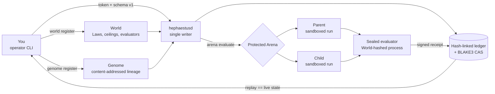

<p align="center">
  
</p>

<h1 align="center">Hephaestus</h1>

<p align="center">
  <em>An evidence-first control plane for evolving AI agents. Every claim of improvement has a receipt.</em>
</p>

<p align="center">
  <a href="https://github.com/randyren278/hephaestus/actions/workflows/ci.yml"></a>
  
  
  
</p>

Most "self-improving agent" loops keep score by vibes: a model rewrites its
own prompt, a benchmark number goes up, and nobody can say afterwards which
change caused it or how to get the old version back. Hephaestus is the
boring, stubborn part of that loop done properly. An agent configuration is
an immutable, content-addressed Genome, scored in an isolated sandbox against
a sealed evaluator it can never read, with every run and receipt written to a
hash-linked ledger. Kill the daemon and restart it, and it rebuilds that exact
history from disk or refuses to start.

## Install

Source checkout: `git clone https://github.com/randyren278/hephaestus.git && cd hephaestus && scripts/install.sh`

Then run `heph` — it starts the daemon, opens the operator console, and walks
you through a short tour on first launch; `heph --tour` replays it. New to
Hephaestus? [Getting started](docs/GETTING_STARTED.md) covers the same ground
in more detail.

Prefer a macOS package? See [macOS installation](docs/MACOS_INSTALL.md).

## Quickstart

Prerequisites: macOS, `git`, and a stable Rust toolchain (1.85+).

```bash
hephaestus world register world.json
hephaestus genome register parent.md --world hephaestus:world:<id>
hephaestus genome register child.md  --world hephaestus:world:<id>
hephaestus unfreeze
hephaestus run hephaestus:genome:<parent>
hephaestus arena evaluate eval-001 hephaestus:genome:<parent> hephaestus:genome:<child>
hephaestus arena select eval-001
hephaestus replay
```

That registers a World and two Genomes, runs the parent, measures parent
against child in a protected Arena, then verifies the whole ledger replays
byte-for-byte. Prefer one command? `scripts/quickstart.sh` builds the
workspace, drives this exact loop against a scratch daemon, then `kill -9`s
it and brings it back to prove the state is canonical history. Full
walkthrough, including building the World's evaluator artifacts: [docs/CLI.md](docs/CLI.md).

## How it works



Candidates never see canonical storage, the evaluator, expected outputs, or
each other. The daemon starts **frozen**; only the operator can unfreeze it,
and that decision is itself a ledgered event. Every Arena run pins one
revision, seed, and budget for both trials, and returns only the aggregates
the operator is authorized to see.

## Why you can trust it

- **353 deliberate source mutations** run in CI after the test suite passes, each disabling one documented invariant; the suite must go red for every single one, or the build fails.
- An 80% per-module coverage floor across 37 production-critical modules, `clippy::pedantic` at deny, `unsafe` forbidden workspace-wide, and a docs gate that fails if any path this documentation mentions stops existing.
- The threat model is written down, not implied: a candidate is assumed hostile, the evaluator is assumed to leak if it can, and the daemon would rather not start than start with a ledger it cannot verify. See [docs/THREAT_MODEL.md](docs/THREAT_MODEL.md), including how to verify all of this yourself.

## Documentation

- [Getting Started](docs/GETTING_STARTED.md): first-run walkthrough
- [Status](docs/STATUS.md): what is built and what is not
- [CLI Reference](docs/CLI.md): daily use and every command
- [Architecture](docs/ARCHITECTURE.md): crate map, trust boundary, and the full system diagram
- [Control Plane](docs/CONTROL_PLANE.md) · [Worlds](docs/WORLDS.md) · [Genomes](docs/GENOMES.md): daemon lifecycle and compiler contracts
- [Runtimes and Sandboxes](docs/RUNTIMES.md) · [Traces and Experience](docs/EXPERIENCE.md) · [Ledgers and Artifacts](docs/LEDGERS.md): execution and storage internals
- [Evolution](docs/EVOLUTION.md) · [Drift, shadow, and canary control](docs/CANARY.md) · [Gene Bank](docs/GENE_BANK.md) · [Meta-evolution](docs/META_EVOLUTION.md): the evolve/Champion/Gene loop
- [MCP Gateway](docs/MCP_GATEWAY.md) · [Remote Workers](docs/REMOTE_WORKERS.md): the distributed surfaces
- [Threat Model](docs/THREAT_MODEL.md) · [Adversarial coverage](docs/ADVERSARIAL.md) · [Releases](docs/RELEASES.md) · [Self-dogfooding](docs/SELF_DOGFOODING.md): security, supply chain, and how to verify it yourself
- [Constitution](docs/CONSTITUTION.md) · [Terminology](docs/TERMINOLOGY.md) · [Evaluation Philosophy](docs/EVALUATION_PHILOSOPHY.md) · [Hera Inheritance](docs/HERA_INHERITANCE.md) · [Iris Inheritance](docs/IRIS_INHERITANCE.md): concepts and lineage
- [Lab cross-check](docs/LAB_CROSSCHECK.md): independent Python recompute of Rust selection and meta-evolution receipts
- [macOS installation](docs/MACOS_INSTALL.md)
- Operator console: [TUI](apps/hephaestus-tui/README.md) · [Web](apps/hephaestus-web/README.md)
- [Feature audit](AUDIT.md)

## License

MIT. See [LICENSE](LICENSE).
