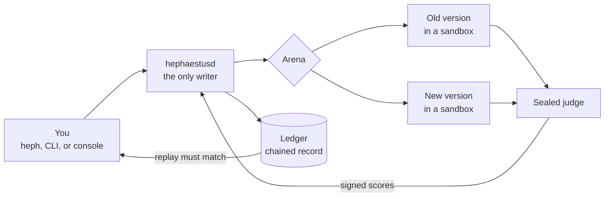

<p align="center">
  
</p>

<h1 align="center">Hephaestus</h1>

<p align="center">
  <strong>A fair referee for AI agents.</strong><br>
  Change your agent, and Hephaestus tells you whether it actually got better, with proof you can check.
</p>

<p align="center">
  <a href="#install">Install</a> ·
  <a href="#the-words-youll-see">Glossary</a> ·
  <a href="#try-it-in-five-minutes">Try it</a> ·
  <a href="#just-here-for-the-senate">The Senate</a> ·
  <a href="docs/STATUS.md">What works today</a>
</p>

## What is this?

You have an AI agent, meaning a model plus a prompt plus some permissions.
You tweak the prompt. Is the new version better? Usually the honest answer is
"it felt better on a few tries." Nobody can say afterwards what changed, and
nobody can get the old version back.

Hephaestus replaces that guesswork with a fair fight. It runs the old and new
versions on the same tasks, each locked in its own sandbox, and a judge they
cannot see scores them. It writes the result into a record that cannot be
quietly rewritten, so "version B is better" becomes a claim anyone can check
later.

<p align="center">
  
</p>

The name comes from the Greek god of the forge. Agents get hammered on,
tested, and only the good ones are kept.

## The words you'll see

Hephaestus uses a small vocabulary, and each word has one exact meaning. Here
they are in plain English.

| Word | Plain meaning | Think of it as |
|---|---|---|
| **Genome** | One exact version of an agent: its prompt, model, and permissions. It gets a fingerprint from its contents, so any change makes a new Genome. | A recipe card sealed in plastic |
| **World** | The test an agent is measured in: its tasks, its time and cost limits, the judge, and the rules. | The exam, plus the exam-hall rules |
| **Law** | A rule of a World that no agent can change, such as "agents may never read the judge". | A rule written on the wall |
| **Arena** | Where two Genomes are compared on identical tasks, each in its own sandbox. | The exam hall |
| **Evaluator** | The program that scores each run. Agents can never read it or the answers. | A judge behind a curtain |
| **Ledger** | The permanent record of everything that happened. Each entry is chained to the one before it, so edits are detectable. | A notebook with numbered, glued-in pages |
| **Receipt** | The saved proof behind one decision: what ran, what it scored, and why the verdict came out the way it did. | A signed scorecard |
| **Champion** | The version currently trusted as best for a World. It changes only when a challenger wins fairly. | The title holder |
| **Freeze** | Hephaestus always starts paused. Only you can unpause it, and that choice is recorded too. | The emergency brake, on by default |
| **Daemon** | `hephaestusd`, the background program that does the work and is the only thing allowed to write to the Ledger. | The referee's office |

More terms, such as Forge, Gene, Lineage, Drift, and Canary, are in
[the full glossary](docs/TERMINOLOGY.md).

## Install

You need **macOS**, **git**, **npm**, and **Rust 1.85 or newer**. If you
don't have Rust, install it from [rustup.rs](https://rustup.rs).

**1. Download and install**

```bash
git clone https://github.com/randyren278/hephaestus.git
cd hephaestus
scripts/install.sh
```

This builds everything and puts the programs in `~/.local/bin`. It never uses
`sudo`. When run from a terminal, it first asks whether you're just here for
the Senate (see [below](#just-here-for-the-senate)).

**2. Make sure your shell can find them.** Skip this step if `~/.local/bin` is already on your `PATH`.

```bash
export PATH="$HOME/.local/bin:$PATH"
```

**3. Start it**

```bash
heph
```

`heph` starts Hephaestus in the background and opens a guided six-step tour
in your terminal. The tour does everything for real: it creates a World and
two agents, runs a fair fight between them, and proves the record is intact.
To see the tour again later:

```bash
heph --tour
```

Prefer a prebuilt macOS package? See [macOS installation](docs/MACOS_INSTALL.md).

## Try it in five minutes

The quickest proof is one script. It builds everything and runs the whole
loop against a throwaway copy of Hephaestus. Then it force-kills that copy,
restarts it, and checks that nothing was lost:

```bash
scripts/quickstart.sh
```

The example it uses is deliberately tiny. The task is "repeat this text back in
capital letters". The parent agent returns the text unchanged and scores **0 of
2**. The child agent turns it into capitals and scores **2 of 2**. Hephaestus
records the child's win with a receipt.

To do the same steps by hand, one command at a time:

```bash
# 1. Set up the exam (a World)
hephaestus world register world.json

# 2-3. Register the original agent and the changed one (two Genomes)
hephaestus genome register parent.md --world hephaestus:world:<id>
hephaestus genome register child.md  --world hephaestus:world:<id>

# 4. Release the brake (Hephaestus starts frozen)
hephaestus unfreeze

# 5. Try the original once, in a sandbox
hephaestus run hephaestus:genome:<parent>

# 6. The fair fight: both agents, same tasks, sealed judge
hephaestus arena evaluate eval-001 hephaestus:genome:<parent> hephaestus:genome:<child>

# 7. Record the verdict as a receipt
hephaestus arena select eval-001

# 8. Prove the whole record is intact
hephaestus replay
```

Each `<id>` is the fingerprint Hephaestus prints when you register something.
The full walkthrough, including how to build the judge, is in
[the CLI guide](docs/CLI.md).

## Just here for the Senate?

<p align="center">
  
</p>

The Senate is a separate tool in this repository. You ask it a question, a
decision, or a draft document. A panel of simulated perspectives, written "in
the spirit of" thinkers like Socrates, Ada Lovelace, and Adam Smith, debates
it and hands back one answer. It runs on the Claude Code or Codex subscription
you already have and needs none of the rest of Hephaestus.

```bash
scripts/install.sh --senate-only
```

```bash
senate ask "Should we rewrite this service or refactor it?" --size M
```

Sizes run from `S` (3 senators) to `XL` (15). Every answer notes that the
senators are AI simulations, not the real people. The full guide covers
sizes, cost, and how to add a document for review: [the Senate](docs/SENATE.md).

## Why you can trust it

- **The agents can't cheat.** Each agent runs in a locked-down macOS sandbox
  with hard time and output limits. The judge and the answers are kept where
  an agent can never read them.
- **The record can't be quietly edited.** Every entry in the Ledger is chained
  to the one before it. On every start, Hephaestus rebuilds its state from that
  record and refuses to start if anything doesn't match. `hephaestus replay`
  runs the same check whenever you like.
- **You hold the brake.** Hephaestus starts frozen. Only you can unfreeze it,
  and stopping work is confirmed, not assumed.
- **The tests are tested.** CI breaks the code on purpose in **357** separate
  ways, and the test suite has to catch every one or the build fails. 39
  safety-critical modules must also stay at 80% test coverage or better.

The threat model, including how to check all of this yourself, is in
[docs/THREAT_MODEL.md](docs/THREAT_MODEL.md).

## What works today, and what doesn't yet

Hephaestus is honest about its limits, so here they are up front:

- ✅ Registering agents and Worlds, sandboxed runs, fair Arena comparisons,
  receipts, full replay, freeze and kill, and the terminal and web consoles.
- ✅ Unattended multi-generation runs (`hephaestus evolve`) that only promote
  a new Champion when the evidence clears the World's bar.
- ⚠️ **The agents it runs today are simple built-in test agents**, not live
  Claude or Codex sessions. Adapters for Claude Code and Codex exist and are
  tested, but running them for real is an opt-in you switch on yourself.
- ⚠️ **Automatic improvement is minimal.** The only change Hephaestus can
  propose on its own is one small built-in switch. It proves the machinery,
  not a smart optimizer.
- ⚠️ **Running agents needs macOS**, because the sandbox is macOS's. On other
  systems you can still register, inspect, and replay.

The detailed list is in [docs/STATUS.md](docs/STATUS.md), and the evidence
behind every feature is in [AUDIT.md](AUDIT.md).

## Under the hood


```mermaid
flowchart LR
    you["You<br/>heph, CLI, or console"] --> daemon["hephaestusd<br/>the only writer"]
    daemon --> arena{"Arena"}
    arena --> old["Old version<br/>in a sandbox"]
    arena --> new["New version<br/>in a sandbox"]
    old --> judge["Sealed judge"]
    new --> judge
    judge -- "signed scores" --> daemon
    daemon --> ledger[("Ledger<br/>chained record")]
    ledger -- "replay must match" --> you
```

There is one writer, one record, and a sandbox for every agent run. The
[architecture guide](docs/ARCHITECTURE.md) has the full diagram and the crate
map.

## Documentation

**Start here**
- [Getting started](docs/GETTING_STARTED.md): install, first launch, and the guided tour
- [Glossary](docs/TERMINOLOGY.md): every Hephaestus word in plain English
- [What works today](docs/STATUS.md): built versus not yet built
- [The Senate](docs/SENATE.md): the multi-perspective debate tool

**Using it**
- [CLI guide](docs/CLI.md): every command, and a hand-driven walkthrough
- [Worlds](docs/WORLDS.md) and [Genomes](docs/GENOMES.md): how to write your own exam and agents
- [Evolution](docs/EVOLUTION.md), [Canary rollouts](docs/CANARY.md), [Gene Bank](docs/GENE_BANK.md), [Meta-evolution](docs/META_EVOLUTION.md): automated improvement and safe rollouts
- Consoles: [terminal (TUI)](apps/hephaestus-tui/README.md) and [web](apps/hephaestus-web/README.md)
- [macOS package install](docs/MACOS_INSTALL.md)

**How it's built**
- [Architecture](docs/ARCHITECTURE.md), [Control plane](docs/CONTROL_PLANE.md), [Runtimes and sandboxes](docs/RUNTIMES.md), [Traces](docs/EXPERIENCE.md), [Ledgers](docs/LEDGERS.md)
- [MCP gateway](docs/MCP_GATEWAY.md) and [Remote workers](docs/REMOTE_WORKERS.md)

**Trust and background**
- [Threat model](docs/THREAT_MODEL.md), [Adversarial coverage](docs/ADVERSARIAL.md), [Releases](docs/RELEASES.md), [Self-dogfooding](docs/SELF_DOGFOODING.md), [Lab cross-check](docs/LAB_CROSSCHECK.md)
- [Constitution](docs/CONSTITUTION.md), [Evaluation philosophy](docs/EVALUATION_PHILOSOPHY.md), [Hera inheritance](docs/HERA_INHERITANCE.md), [Iris inheritance](docs/IRIS_INHERITANCE.md)
- [Feature audit](AUDIT.md)

## License

MIT. See [LICENSE](LICENSE).
