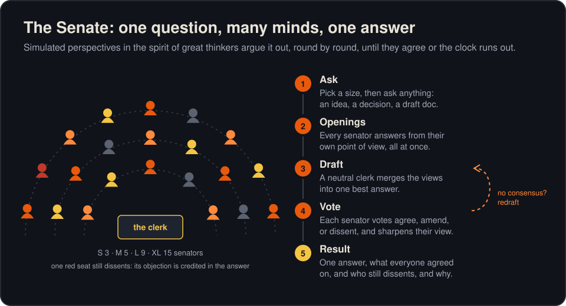
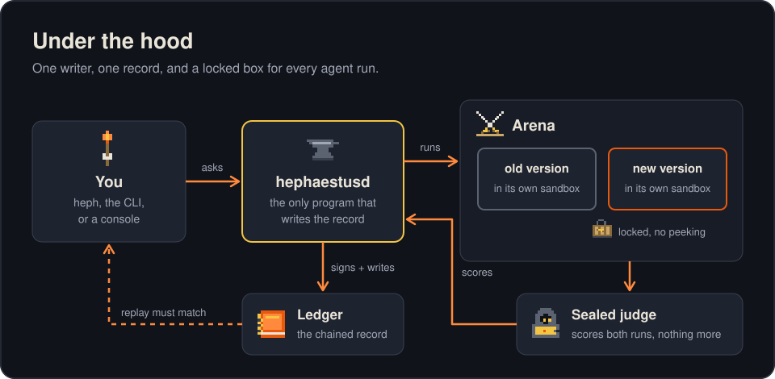

<p align="center">
  
</p>

<h1 align="center">Hephaestus</h1>

<p align="center">
  <strong>A fair referee for AI agents.</strong><br>
  Compare prompt versions on your own tasks, with results you can replay.
</p>

<p align="center">
  <a href="#install">Install</a> ·
  <a href="#the-words-youll-see">Glossary</a> ·
  <a href="#try-it-in-five-minutes">Try it</a> ·
  <a href="#just-here-for-the-senate">The Senate</a>
</p>

## What is this?

You have an AI agent: a model, a prompt and some permissions. You change its
prompt. Which version gets more of your tasks right, and what changed in its
latency or reported usage?

Hephaestus replaces that guesswork with a fair fight. It runs the old and new
versions on the same tasks, each locked in its own sandbox, and a judge they
cannot directly read scores them under fixed rules. It keeps the exact versions
and results in a tamper-evident ledger you can replay. A comparison measures
those tasks; its confidence interval and separate gates help you decide what
the result supports.

Start with a workflow that has checkable answers, such as ticket routing or
structured extraction. The [24-case support-triage pack](examples/support-triage/README.md)
provides fictional inputs and two reasonable prompt variants. You can prepare
it while the daemon is frozen, then review the provider allowance before
running a model. The [pilot guide](docs/PILOT_GUIDE.md) explains the deliverables
and how to evaluate a change on your own workflow.

<p align="center">
  
</p>

The name comes from the Greek god of the forge. Agents get hammered on,
tested, and only the good ones are kept.

## The words you'll see

<p align="center">
  
</p>

More terms, such as Forge, Gene, Lineage, Drift, and Canary, are in
[the full glossary](docs/TERMINOLOGY.md).

## Install

You need **macOS**, **git**, **Node.js 22 or newer with npm**, and **Rust 1.88 or newer**. If you
don't have Rust, install it from [rustup.rs](https://rustup.rs).

**1. Download and install**

```bash
git clone https://github.com/randyren278/hephaestus.git
cd hephaestus
scripts/install.sh
```

This builds everything and puts the programs in `~/.local/bin`. It never uses
`sudo`. When run from a terminal, it first asks whether you're just here for
the Senate (see [below](#just-here-for-the-senate)).

**2. Make sure your shell can find them.** Skip this step if `~/.local/bin` is already on your `PATH`.

```bash
export PATH="$HOME/.local/bin:$PATH"
```

**3. Start it**

```bash
heph
```

`heph` starts Hephaestus in the background and opens a guided six-step tour
in your terminal. The tour does everything for real: it creates a World and
two agents, runs a fair fight between them, and proves the record is intact.
To see the tour again later:

```bash
heph --tour
```

Prefer a prebuilt macOS package? See [macOS installation](docs/MACOS_INSTALL.md).

Run `heph web` to inspect the same daemon in your browser and download
comparison reports. The macOS package includes its Node runtime and browser
assets. For a separate pilot, use `heph web --data-dir /path/to/data --no-daemon`
and open the printed local URL.

## Try it in five minutes

The quickest proof is one script. It builds everything and runs the whole
loop against a throwaway copy of Hephaestus. Then it force-kills that copy,
restarts it, and checks that nothing was lost:

```bash
scripts/quickstart.sh
```

The example it uses is deliberately tiny. The task is "repeat this text back in
capital letters". The parent agent returns the text unchanged and scores **0 of
2**. The child agent turns it into capitals and scores **2 of 2**. Hephaestus
records the child's win with a receipt.

To do the same steps by hand, one command at a time:

```bash
# 1. Set up the exam (a World)
hephaestus world register world.json

# 2-3. Register the original agent and the changed one (two Genomes)
hephaestus genome register parent.md --world hephaestus:world:<id>
hephaestus genome register child.md  --world hephaestus:world:<id>

# 4. Release the brake (Hephaestus starts frozen)
hephaestus unfreeze

# 5. Try the original once, in a sandbox
hephaestus run hephaestus:genome:<parent>

# 6. The fair fight: both agents, same tasks, sealed judge
hephaestus arena evaluate eval-001 hephaestus:genome:<parent> hephaestus:genome:<child>

# 7. Record the verdict as a receipt
hephaestus arena select eval-001

# 8. Prove the whole record is intact
hephaestus replay
```

Each `<id>` is the fingerprint Hephaestus prints when you register something.
The full walkthrough, including how to build the judge, is in
[the CLI guide](docs/CLI.md).

## Just here for the Senate?

<p align="center">
  
</p>

The Senate is a separate tool in this repository. You ask it a question, a
decision, or a draft document. A panel of simulated perspectives, written "in
the spirit of" thinkers like Socrates, Ada Lovelace, and Adam Smith, debates
it and hands back one answer. It runs on the Claude Code or Codex subscription
you already have and needs none of the rest of Hephaestus.

```bash
scripts/install.sh --senate-only
```

```bash
senate ask "Should we rewrite this service or refactor it?" --size M
```

Sizes run from `S` (3 senators) to `XL` (15). Every answer notes that the
senators are AI simulations, not the real people. The full guide covers
sizes, cost, and how to add a document for review: [the Senate](docs/SENATE.md).

## Why you can trust it

- **Separate execution and scoring.** Each agent runs in a macOS sandbox
  with enforced time and output limits. Protected evaluator files are outside
  its filesystem authority. Keep your holdout labels out of its repository
  and use private tasks for a confidential benchmark.
- **A tamper-evident record.** Every entry in the Ledger is chained
  to the one before it. On every start, Hephaestus rebuilds its state from that
  record and refuses to start if anything doesn't match. `hephaestus replay`
  runs the same check whenever you like.
- **You hold the brake.** Hephaestus starts frozen. Only you can unfreeze it,
  and stopping work is confirmed, not assumed.
- **The tests are tested.** CI is configured to break the code in **429** separate
  ways, and the test suite has to catch every one or the build fails. 51
  safety-critical modules must also stay at 92% test coverage or better.

The threat model, including how to check all of this yourself, is in
[docs/THREAT_MODEL.md](docs/THREAT_MODEL.md).

## Under the hood

<p align="center">
  
</p>

There is one writer, one record, and a sandbox for every agent run. The
[architecture guide](docs/ARCHITECTURE.md) has the full diagram and the crate
map.

## Documentation

**Start here**
- [Getting started](docs/GETTING_STARTED.md): install, first launch, and the guided tour
- [Glossary](docs/TERMINOLOGY.md): every Hephaestus word in plain English
- [What works today](docs/STATUS.md): built versus not yet built
- [Pilot guide](docs/PILOT_GUIDE.md): evaluate one change on your workflow
- [The Senate](docs/SENATE.md): the multi-perspective debate tool

**Using it**
- [CLI guide](docs/CLI.md): every command, and a hand-driven walkthrough
- [Worlds](docs/WORLDS.md) and [Genomes](docs/GENOMES.md): how to write your own exam and agents
- [Evolution](docs/EVOLUTION.md), [Canary rollouts](docs/CANARY.md), [Gene Bank](docs/GENE_BANK.md), [Meta-evolution](docs/META_EVOLUTION.md): automated improvement and safe rollouts
- Consoles: [terminal (TUI)](apps/hephaestus-tui/README.md) and [web](apps/hephaestus-web/README.md)
- [macOS package install](docs/MACOS_INSTALL.md)

**How it's built**
- [Architecture](docs/ARCHITECTURE.md), [Control plane](docs/CONTROL_PLANE.md), [Runtimes and sandboxes](docs/RUNTIMES.md), [Traces](docs/EXPERIENCE.md), [Ledgers](docs/LEDGERS.md)
- [MCP gateway](docs/MCP_GATEWAY.md) and [Remote workers](docs/REMOTE_WORKERS.md)

**Trust and background**
- [Threat model](docs/THREAT_MODEL.md), [Adversarial coverage](docs/ADVERSARIAL.md), [Releases](docs/RELEASES.md), [Self-dogfooding](docs/SELF_DOGFOODING.md), [Lab cross-check](docs/LAB_CROSSCHECK.md)
- [Constitution](docs/CONSTITUTION.md), [Evaluation philosophy](docs/EVALUATION_PHILOSOPHY.md), [Hera inheritance](docs/HERA_INHERITANCE.md), [Iris inheritance](docs/IRIS_INHERITANCE.md)
- [Feature audit](AUDIT.md)

## License

MIT. See [LICENSE](LICENSE).
