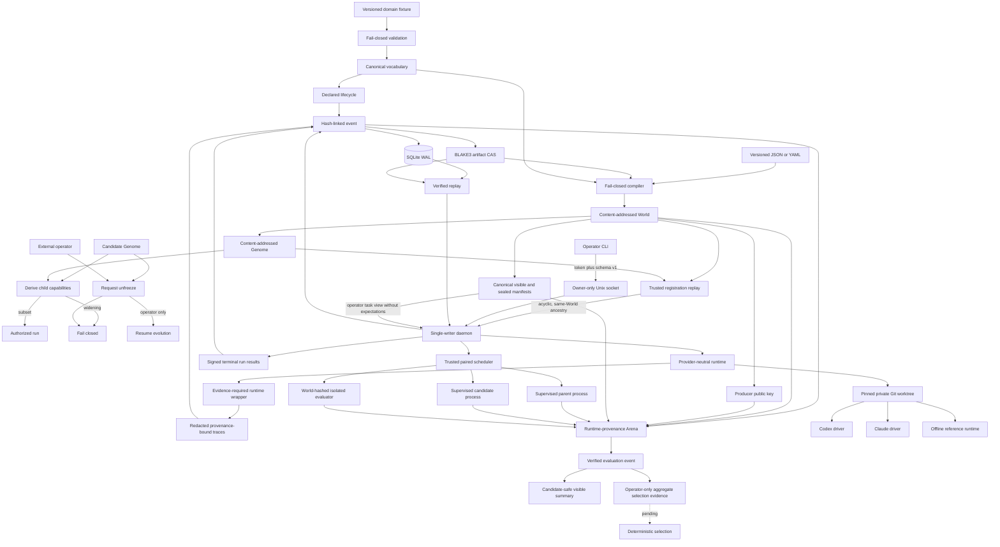

# Architecture

The Rust workspace separates Laws and domain contracts, canonical evidence persistence, immutable Genome/World compilation, the local daemon boundary, capability-scoped runtimes, and the Experience Plane. New planes are added only with executable invariants.

## Trust boundary

The authority, domain, compiler, Genome, World, registry, event-store, artifact-store, runtime, isolation, control, Experience, Arena, evaluator-protocol, and isolated-evaluator modules named by `checks/checks.json` are production-critical. The manifest sets a per-module coverage floor (80% while coverage debt is tracked in TECH_DEBT.md; the target is 95%) and deliberate source mutations for implemented invariants. Mutation commands and timeouts resolve by longest file-prefix match, while an explicit CLI test command overrides every scoped command. Each suite runs in a fresh process group; timeout or interruption terminates and waits for descendants before byte-exact source restoration. The mutation ratchet may only increase.

## Repository map

- `crates/hephaestus-core/` — shared trust primitives.
- `crates/hephaestus-control/` — daemon, versioned local API, and operator CLI.
- `crates/hephaestus-arena/` — World-bound deterministic paired measurement, strict manifest rehydration, operator-safe task scheduling, authenticated terminal metrics, sealed receipts, and restart-safe event-bound selection evidence.
- `crates/hephaestus-experience/` — redacted traces, runtime evidence integration, and restart-safe trusted Experience rehydration with recursive provenance checks.
- `crates/hephaestus-genome/` — canonical Genome and World compilers, plus the trusted registration registry that replays `world.registered` / `genome.registered` events in ledger order and fails closed on missing Worlds, unregistered or cross-World parents, non-canonical payloads or artifacts, and conflicting metadata.
- `crates/hephaestus-ledger/` — canonical events and artifacts.
- `crates/hephaestus-runtime/` — capability-scoped worktrees and runtime adapters.
- `examples/quickstart/` — a World template, a parent Genome, a child Genome template, and visible/sealed task manifests.
- `scripts/quickstart.sh` — builds and drives the complete loop against real binaries.
- `checks/` — coverage, mutation, and documentation gates.
- `.github/workflows/ci.yml` — deterministic and adversarial CI jobs.
- `HEPHAESTUS_MASTER_PLAN.md` — product and engineering specification.
