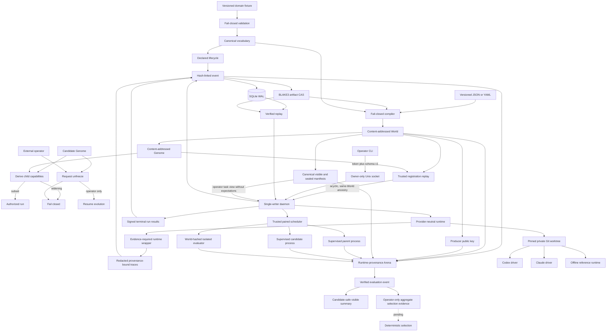

# Architecture

**In short.** Hephaestus is a set of Rust libraries stacked in four layers. At the bottom are the rules and the permanent record. Above them sit the parts that seal agents and exams, run agents in sandboxes, record what happened, and compare agents fairly. Above those sits the daemon, the one program allowed to write the record. At the top are the consoles and command-line programs you use. The Senate debate tool stands on its own.

  

The rest of this page is the precise reference, including the full system diagram.

The Rust workspace separates Laws and domain contracts, canonical evidence persistence, immutable Genome/World compilation, the local daemon boundary, capability-scoped runtimes, and the Experience Plane. New planes are added only with executable invariants.

```mermaid
flowchart TD
    Candidate[Candidate Genome] --> Derive[Derive child capabilities]
    Derive -->|subset| Run[Authorized run]
    Derive -->|widening| Deny[Fail closed]
    Candidate --> Unfreeze[Request unfreeze]
    Unfreeze --> Deny
    Operator[External operator] --> Unfreeze
    Unfreeze -->|operator only| Resume[Resume evolution]
    Fixture[Versioned domain fixture] --> Validate[Fail-closed validation]
    Validate --> Vocabulary[Canonical vocabulary]
    Vocabulary --> Lifecycle[Declared lifecycle]
    Lifecycle --> Event[Hash-linked event]
    Event --> SQLite[(SQLite WAL)]
    Event --> CAS[BLAKE3 artifact CAS]
    SQLite --> Replay[Verified replay]
    CAS --> Replay
    Source[Versioned JSON or YAML] --> Compile[Fail-closed compiler]
    CAS --> Compile
    Vocabulary --> Compile
    Compile --> World[Content-addressed World]
    World --> Genome[Content-addressed Genome]
    World --> Registry[Trusted registration replay]
    Genome --> Registry
    Registry -->|acyclic, same-World ancestry| Daemon
    Genome --> Derive
    CLI[Operator CLI] -->|token plus schema v1| Socket[Owner-only Unix socket]
    Socket --> Daemon[Single-writer daemon]
    Daemon --> Event
    Replay --> Daemon
    Daemon --> Runtime[Provider-neutral runtime]
    Runtime --> Recorded[Evidence-required runtime wrapper]
    Recorded --> Experience[Redacted provenance-bound traces]
    Experience --> Event
    Event --> Arena[Runtime-provenance Arena]
    World --> Arena
    Daemon --> Signed[Signed terminal run results]
    Signed --> Event
    World --> Verifier[Producer public key]
    Verifier --> Arena
    World --> Manifests[Canonical visible and sealed manifests]
    Manifests -->|operator task view without expectations| Daemon
    Manifests --> Arena
    Runtime --> Sandbox[Pinned private Git worktree]
    Daemon --> Pair[Trusted paired scheduler]
    Pair --> Parent[Supervised parent process]
    Pair --> CandidateRun[Supervised candidate process]
    Parent --> Arena
    CandidateRun --> Arena
    Pair --> Evaluator[World-hashed isolated evaluator]
    Evaluator --> Arena
    Arena --> EvalEvent[Verified evaluation event]
    EvalEvent --> SafeSummary[Candidate-safe visible summary]
    EvalEvent --> OperatorEvidence[Operator-only aggregate selection evidence]
    OperatorEvidence -. pending .-> Selection[Deterministic selection]
    Sandbox --> Codex[Codex driver]
    Sandbox --> Claude[Claude driver]
    Sandbox --> Reference[Offline reference runtime]
```

## Trust boundary

The authority, domain, compiler, Genome, World, registry, event-store, artifact-store, runtime, isolation, control, Experience, Arena, evaluator-protocol, and isolated-evaluator modules named by `checks/checks.json` are production-critical. The manifest sets a per-module coverage floor (80% while coverage debt is tracked in TECH_DEBT.md; the target is 95%) and deliberate source mutations for implemented invariants. Mutation commands and timeouts resolve by longest file-prefix match, while an explicit CLI test command overrides every scoped command. Each suite runs in a fresh process group; timeout or interruption terminates and waits for descendants before byte-exact source restoration. The mutation ratchet may only increase.

## Repository map

- `crates/hephaestus-core/` — shared trust primitives.
- `crates/hephaestus-control/` — daemon, versioned local API, and operator CLI.
- `crates/hephaestus-arena/` — World-bound deterministic paired measurement, strict manifest rehydration, operator-safe task scheduling, authenticated terminal metrics, sealed receipts, and restart-safe event-bound selection evidence.
- `crates/hephaestus-experience/` — redacted traces, runtime evidence integration, and restart-safe trusted Experience rehydration with recursive provenance checks.
- `crates/hephaestus-genome/` — canonical Genome and World compilers, plus the trusted registration registry that replays `world.registered` / `genome.registered` events in ledger order and fails closed on missing Worlds, unregistered or cross-World parents, non-canonical payloads or artifacts, and conflicting metadata.
- `crates/hephaestus-ledger/` — canonical events and artifacts.
- `crates/hephaestus-runtime/` — capability-scoped worktrees and runtime adapters.
- `crates/hephaestus-senate/` — the standalone Senate debate CLI (`senate`); it depends on no other workspace crate. See [SENATE.md](SENATE.md).
- `apps/hephaestus-tui/` and `apps/hephaestus-web/` — the terminal and web operator consoles.
- `examples/quickstart/` — a World template, a parent Genome, a child Genome template, and visible/sealed task manifests.
- `scripts/quickstart.sh` — builds and drives the complete loop against real binaries.
- `checks/` — coverage, mutation, and documentation gates.
- `.github/workflows/ci.yml` — deterministic and adversarial CI jobs.
