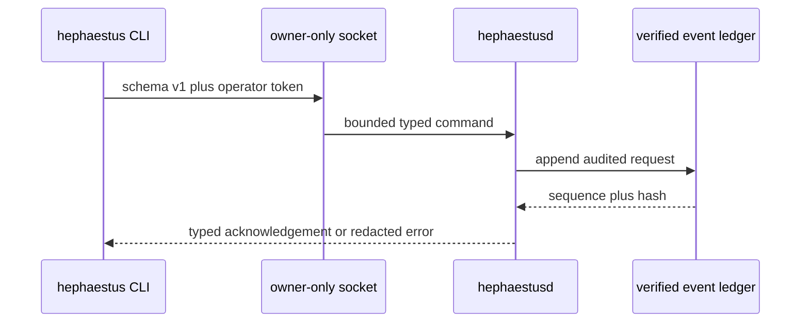

# Local Control Plane

`hephaestusd` is the only process allowed to mutate canonical local state. It takes an advisory exclusive lock, verifies the complete hash-linked ledger, replays every `world.registered` and `genome.registered` event through the trusted registry (a Genome before its World, a parent under another World, a non-canonical payload or artifact, or changed immutable metadata fails startup), verifies every trace, authenticated run result, and artifact, reconstructs the control projection, and only then binds an owner-only Unix socket. The data directory and artifact root are mode 0700; the socket, database, lock, 256-bit operator token, and separate Ed25519 runtime-producer seed are mode 0600. The producer key is never sent to a runtime or client. If signed result history or a registered World verifier anchors the producer, a missing, replaced, malformed, symlinked, or broadly readable key fails startup rather than silently rotating trust.



## Operator commands

The CLI defaults to `HEPHAESTUS_HOME`, then the user's `.hephaestus` directory. A specific data directory can be supplied with `--data-dir`.

```bash
hephaestus status
hephaestus freeze
hephaestus unfreeze
hephaestus kill --all
hephaestus arena manifest <file>
hephaestus artifact put <file>
hephaestus verifier
hephaestus world register <file>
hephaestus world list
hephaestus world show <id>
hephaestus genome register <file> --world <world-id>
hephaestus genome list
hephaestus genome show <id>
hephaestus run <genome-id>
hephaestus evaluate <genome-id> --task-id <id> --input <text> --seed <u64> \
  --wall-millis <u64> --maximum-output-bytes <u64> --maximum-cost-microusd <u64>
hephaestus arena evaluate <evaluation-id> <parent-id> <candidate-id>
hephaestus arena select <evaluation-id>
hephaestus replay
hephaestus daemon stop
```

## Registration

Worlds and Genomes enter canonical state only through the daemon. `world register` and `genome register` take an absolute path (the CLI canonicalizes relative ones) to a `.json`, `.yaml`, or `.yml` source no larger than 1 MiB, compile it with the same fail-closed compilers replay uses, store the canonical bytes in the CAS, and append a `world.registered` or `genome.registered` event whose aggregate is the content identity. The daemon never resolves a path relative to its own working directory. Registering identical source again returns the existing record without appending; registering a Genome names its World explicitly and compiles against the parents already registered under that World, so a parent from another World or an unregistered parent is refused with the compiler's reason. A World that declares `arena.runtime_verifier` must anchor this daemon's own producer key, otherwise the next startup would fail closed; the daemon rejects it immediately instead. `arena manifest` canonicalizes an operator-authored task manifest (whitespace, key order, and task order normalized) and stores only the canonical bytes the Arena accepts; `artifact put` stores any file up to 64 MiB by BLAKE3 address; `verifier` publishes the daemon's Ed25519 public key as an artifact for use as a World's `arena.runtime_verifier`. All of these are audited like every other command.

After every append the daemon rebuilds its projection from verified history through `RegisteredObjects` in `crates/hephaestus-genome/src/registry.rs`, the same replay path startup uses, so a live registration and a replayed one are indistinguishable.

`freeze`, `unfreeze`, and `kill --all` are canonical events, so restart reconstructs their effects. `replay` independently reloads and verifies history, rebuilds the projection, compares it with live state, and reports a content hash. Genome inspection only returns immutable records whose identity is bound to verified CAS bytes.

`run` requires an unfrozen daemon, a registered Genome, and that Genome's exact registered World. The legacy `evaluate` command adds a bounded typed single task/input/seed/budget run used for low-level contracts. `arena evaluate <evaluation-id> <parent-id> <candidate-id>` is the trusted paired path: callers supply no task inputs, expectations, seeds, environments, or budgets. The daemon recompiles the registered World from verified CAS bytes, strictly rehydrates its visible and sealed manifests, verifies the deployed evaluator executable against the World before candidate scheduling (a mismatch is an integrity failure reported as `internal`, never a hint about the expected bytes; restart `hephaestusd` with the `--evaluator-executable` the World was registered against), and requires two distinct Genomes under that exact World. It fixes one source revision and daemon-owned seed/environment/budget across every task, runs parent and candidate in separately cleaned read-only/offline supervised worktrees, signs their result receipts, and hands the exact plans to Arena. An authenticated terminal failure does not erase the paired observation or abort the evaluation: Arena marks it unreliable and incorrect while retaining its cost and latency. A retry reuses the same deterministic run events and evaluation receipt; a conflicting or malformed pair fails closed. The CLI response contains visible aggregate scores and payload-free event metadata only.

`arena select <evaluation-id>` is an authenticated operator command. It derives the exact registered World from the rehydrated Arena evaluation evidence, then computes or reloads the deterministic selection receipt against that World's policy. The owner-only response exposes the complete receipt, including sealed-derived correctness, reliability, cost, latency, confidence interval, and policy inputs; it must remain on the operator side of the API boundary. A retry recomputes the same receipt and returns the same selection event. Startup and explicit `replay` independently rehydrate every recorded selection and compare the canonical receipt and event against the exact registered World, failing closed for orphan, forged, or noncanonical selections. A selected result is not a promotion: `invariant_gate_verified` and `promotion_eligible` remain false until an independent trusted invariant evaluator exists. `correctness_regressions` counts paired task correctness losses; it does not implement the World's separate `maximum_regressions` invariant policy. `metrics_eligible` reports the measured confidence, Pareto, and cost gates only.

For ordinary reference runs, the daemon fixes the source repository at startup, resolves its current `HEAD` to one immutable commit before sandbox creation, generates the run ID, derives the environment fingerprint, narrows authority to read-only/offline, and hands exclusive ownership of the canonical ledger and CAS to the evidence recorder for the synchronous run. The deterministic adapter inventories an isolated worktree at that exact commit; source revision and runtime-owned experiment context are recorded in the signed result alongside lifecycle evidence, output inventory, CLI response, and replay validation. The daemon stores bounded stdout/stderr in CAS, signs and appends the provenance-bound result, and uses a cleanup guard so every result path attempts worktree removal before returning terminal metadata and artifact IDs. Trace lifecycle receipts drive active-run projection and remain terminal after restart.

## Fail-closed boundaries

Requests are capped at 64 KiB, strictly deserialized, version checked, and authenticated before any consequential action. Authenticated typed requests—including invalid identifiers—are ledgered; malformed or unauthenticated traffic cannot grow canonical history. Replay requires control events to name the exact operator actor and aggregate and to carry a command matching the event type. A registered World's `arena.runtime_verifier` becomes a trust anchor: startup and replay validate the artifact, reject a missing or replaced producer key before the first result, and never mint a replacement. Legacy unsigned schema-1 result history is intentionally incompatible; startup tells the operator to back up the data directory and reinitialize rather than silently rewriting or adopting it. Transport errors are isolated to one connection, and idle reads and writes are time bounded.
