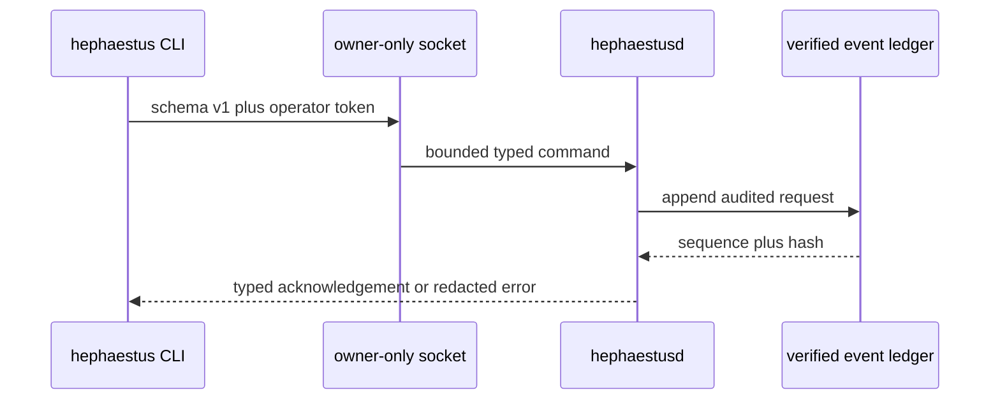

# Local Control Plane

`hephaestusd` is the only process allowed to mutate canonical local state. It takes an advisory exclusive lock, verifies the complete hash-linked ledger, replays every `world.registered` and `genome.registered` event through the trusted registry (a Genome before its World, a parent under another World, a non-canonical payload or artifact, or changed immutable metadata fails startup), verifies every trace, authenticated run result, and artifact, reconstructs the control projection, and only then binds an owner-only Unix socket. The data directory and artifact root are mode 0700; the socket, database, lock, 256-bit operator token, and separate Ed25519 runtime-producer seed are mode 0600. The producer key is never sent to a runtime or client. If signed result history or a registered World verifier anchors the producer, a missing, replaced, malformed, symlinked, or broadly readable key fails startup rather than silently rotating trust.



## Operator commands

The CLI defaults to `HEPHAESTUS_HOME`, then the user's `.hephaestus` directory. A specific data directory can be supplied with `--data-dir`.

```bash
hephaestus status
hephaestus freeze
hephaestus unfreeze
hephaestus kill --all
hephaestus arena manifest <file>
hephaestus artifact put <file>
hephaestus verifier
hephaestus world register <file>
hephaestus world list
hephaestus world show <id>
hephaestus genome register <file> --world <world-id>
hephaestus genome list
hephaestus genome show <id>
hephaestus genome prompt <id>
hephaestus genome assess <assessment-id> --proposal <proposal-id> \
  --selection-event <child-selection-event-id>
hephaestus run <genome-id>
hephaestus submit <job-id> <genome-id>
hephaestus job status <job-id>
hephaestus job kill <job-id>
hephaestus evaluate <genome-id> --task-id <id> --input <text> --seed <u64> \
  --wall-millis <u64> --maximum-output-bytes <u64> --maximum-cost-microusd <u64>
hephaestus arena evaluate <evaluation-id> <parent-id> <candidate-id>
hephaestus arena select <evaluation-id>
hephaestus arena invariants <evaluation-id>
hephaestus champion seed <transition-id> --world <world-id> --genome <genome-id> --reason <text>
hephaestus champion promote <transition-id> --assessment <assessment-id>
hephaestus champion rollback <transition-id> --world <world-id> --reason <text>
hephaestus champion show <world-id>
hephaestus replay
hephaestus daemon stop
```

## Registration

Worlds and Genomes enter canonical state only through the daemon. World sources remain JSON or YAML; Genome sources may also be Markdown files with strict YAML frontmatter and a nonblank UTF-8 body. Source files are capped at 1 MiB. Markdown registration stores the exact body bytes as the reserved prompt artifact, then compiles through the ordinary Genome compiler and checks the same World, parent, and authority constraints. `genome prompt` returns that body only for a registered Genome after verifying the canonical Genome record and prompt CAS bytes. The daemon never resolves a path relative to its own working directory. Registering identical source again returns the existing record without appending; registering a Genome names its World explicitly and compiles against the parents already registered under that World, so a parent from another World or an unregistered parent is refused with the compiler's reason. A World that declares `arena.runtime_verifier` must anchor this daemon's own producer key, otherwise the next startup would fail closed; the daemon rejects it immediately instead. `arena manifest` canonicalizes an operator-authored task manifest (whitespace, key order, and task order normalized) and stores only the canonical bytes the Arena accepts; `artifact put` stores any file up to 64 MiB by BLAKE3 address; `verifier` publishes the daemon's Ed25519 public key as an artifact for use as a World's `arena.runtime_verifier`. All of these are audited like every other command.

After every append the daemon rebuilds its projection from verified history through `RegisteredObjects` in `crates/hephaestus-genome/src/registry.rs`, the same replay path startup uses, so a live registration and a replayed one are indistinguishable.

`freeze`, `unfreeze`, and `kill --all` are canonical events, so restart reconstructs their effects. `replay` independently reloads and verifies history, rebuilds the projection, compares it with live state, and reports a content hash. Genome inspection only returns immutable records whose identity is bound to verified CAS bytes.

`run` requires an unfrozen daemon, a registered Genome, and that Genome's exact registered World. The legacy `evaluate` command adds a bounded typed single task/input/seed/budget run used for low-level contracts. `arena evaluate <evaluation-id> <parent-id> <candidate-id>` is the trusted paired path: callers supply no task inputs, expectations, seeds, environments, or budgets. The daemon recompiles the registered World from verified CAS bytes, strictly rehydrates its visible and sealed manifests, verifies the deployed evaluator executable against the World before candidate scheduling (a mismatch is an integrity failure reported as `internal`, never a hint about the expected bytes; restart `hephaestusd` with the `--evaluator-executable` the World was registered against), and requires two distinct Genomes under that exact World. It fixes one source revision and daemon-owned seed/environment/budget across every task, runs parent and candidate in separately cleaned read-only/offline supervised worktrees, signs their result receipts, and hands the exact plans to Arena. An authenticated terminal failure does not erase the paired observation or abort the evaluation: Arena marks it unreliable and incorrect while retaining its cost and latency. A retry reuses the same deterministic run events and evaluation receipt; a conflicting or malformed pair fails closed. The CLI response contains visible aggregate scores and payload-free event metadata only.

`arena select <evaluation-id>` is an authenticated operator command. It derives the exact registered World from the rehydrated Arena evaluation evidence, then computes or reloads the deterministic selection receipt against that World's policy. The owner-only response exposes the complete receipt, including sealed-derived correctness, reliability, cost, latency, confidence interval, and policy inputs; it must remain on the operator side of the API boundary. A retry recomputes the same receipt and returns the same selection event. Startup and explicit `replay` independently rehydrate every recorded selection and compare the canonical receipt and event against the exact registered World, failing closed for orphan, forged, or noncanonical selections. A selected result is not a promotion: `invariant_gate_verified` and `promotion_eligible` remain false until the separate invariant receipt is joined to selection in a verified promotion decision. `correctness_regressions` counts paired task correctness losses; it does not implement the World's separate `maximum_regressions` invariant policy. `metrics_eligible` reports the measured confidence, Pareto, and cost gates only.

`arena invariants <evaluation-id>` checks the paired run outputs against the registered World's reference-output invariants. The command resolves the World from the exact rehydrated Arena evaluation, and returns operator-only aggregate counts by predicate; it does not expose task IDs or raw outputs. Missing or unauthenticated trial evidence is an error; authenticated unsuccessful trials count as completion-predicate violations. The deterministic receipt and `invariants.recorded` event are idempotent, verified at startup and replay, and unavailable while another job is active. This evidence does not rewrite a selection or Forge assessment, set their invariant flags, or authorize promotion.

`genome assess <assessment-id> --proposal <proposal-id> --selection-event <event-id>` records assessment-only evidence for a proposed child. The supplied selection must come from a new paired evaluation of the proposal's exact parent and child; the selection that preceded the proposal cannot assess it. The receipt's `metrics_eligible` value determines `metrics_passed` or `metrics_rejected`. Assessment is permitted while frozen and refused while an async job is active. It binds the proposal and selection hashes in an idempotent ledger event, but never changes Genome lineage, declares a winner, or promotes; invariant verification and promotion eligibility remain false.

`champion seed|promote|rollback` are the only commands that change which Genome is a World's Champion, and each appends one idempotent `champion.transitioned` event (details in [GENOMES.md](GENOMES.md#champion-transitions)). Seed and promote are refused while frozen; rollback is a safety action and is allowed while frozen. All three are refused while an async job is active. `champion show <world-id>` reconstructs the World's Champion projection from verified history. Startup, explicit `replay`, and every projection refresh recompute each transition from the history that preceded it.

For ordinary synchronous reference runs, the daemon fixes the source repository at startup, resolves its current `HEAD` to one immutable commit before sandbox creation, generates the run ID, derives the environment fingerprint, narrows authority to read-only/offline, and hands exclusive ownership of the canonical ledger and CAS to the evidence recorder. The deterministic adapter inventories an isolated worktree at that exact commit; source revision and runtime-owned experiment context are recorded in the signed result alongside lifecycle evidence, output inventory, CLI response, and replay validation. The daemon stores bounded stdout/stderr in CAS, signs and appends the provenance-bound result, and uses a cleanup guard so every result path attempts worktree removal before returning terminal metadata and artifact IDs. Trace lifecycle receipts drive active-run projection and remain terminal after restart.

`submit <job-id> <genome-id>` and `arena evaluate <evaluation-id> <parent-id> <candidate-id>` use one shared asynchronous job slot. A paired Arena admission captures the exact World, manifests, evaluator, worker, source revision, seed, per-trial budget, overall wall budget, ordered trial plan, and receipt context before dispatch. Parent then candidate trials run under supervised workers; only after each output, trace, and signed result is durably acknowledged does the writer advance progress. Protected evaluator scoring also runs under the guardian and the writer alone commits the canonical evaluation receipt. If the scorer thread cannot launch after all paired trials are signed, the daemon appends an interrupted Arena terminal, then releases the active slot and channels; no evaluation receipt is created. A failed terminal append is returned as an error and leaves the active scoring projection intact for recovery. `job status` exposes only durable job state, phase, and committed-trial count; it does not include task payloads or scores before the canonical evaluation receipt exists. `job kill` and `kill --all` request cancellation; an acknowledgement means the request was recorded, not that a child has stopped. The job becomes terminal only after the guardian confirms process-group termination. Direct worker failures are recorded as signed run failures; a paired wall-budget expiry or scoring failure yields a failed Arena job without an evaluation receipt, while operator cancellation and scorer thread launch failure remain interrupted. If an Arena deadline cancellation event cannot be appended, the worker is still cancelled but the timeout remains retryable until the transition is durable. Freeze blocks new admissions and remains responsive while a job runs. A daemon crash closes the guardian liveness pipe, which contains the active process group. On restart, an unfinished direct job with a matching signed `operator_interrupt` result recovers as state `interrupted` with terminal `interrupted`; if cancellation was durably requested first, it recovers as state `interrupted` with terminal `cancelled`. A signed result that differs from the admitted job specification fails recovery before a terminal event is appended. Other unfinished direct jobs reconcile from signed results and lifecycle evidence. Incomplete Arena jobs become interrupted unless a fully verified evaluation receipt and every ordered successful trial result already exist, in which case startup appends the missing succeeded terminal. Startup and explicit `replay` compare every succeeded Arena terminal's complete embedded evaluation record with the rehydrated receipt. The persisted overall wall budget is enforced from durable admission through trial execution, scoring, and acknowledged writer progress.

## Fail-closed boundaries

Requests are capped at 7 MiB to accommodate JSON escaping of a maximum 1 MiB Markdown Genome, strictly deserialized, version checked, and authenticated before any consequential action. The listener hands connections to a fixed bounded handler pool; request reads and response writes have deadlines, and a full pool or command queue returns `busy` instead of blocking the canonical writer. Authenticated typed requests—including invalid identifiers—are ledgered; malformed or unauthenticated traffic cannot grow canonical history. Replay requires control events to name the exact operator actor and aggregate and to carry a command matching the event type. A registered World's `arena.runtime_verifier` becomes a trust anchor: startup and replay validate the artifact, reject a missing or replaced producer key before the first result, and never mint a replacement. Legacy unsigned schema-1 result history is intentionally incompatible; startup tells the operator to back up the data directory and reinitialize rather than silently rewriting or adopting it. Transport errors are isolated to one connection, and idle reads and writes are time bounded.
