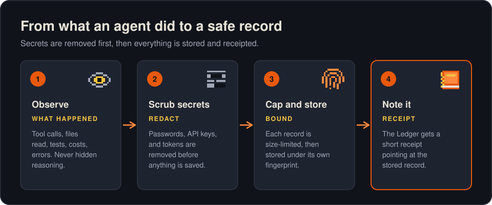
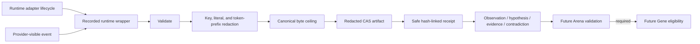

# Traces and Experience

**In short.** While an agent runs, Hephaestus writes down what it visibly did: tool calls, files, tests, costs, and errors, but never hidden reasoning. Before anything is saved, secrets such as passwords and API keys are scrubbed out. Each record is then size-limited, stored under its own fingerprint, and noted in the Ledger with a short receipt.

  

The rest of this page is the precise reference.

`crates/hephaestus-experience/` is the pre-persistence evidence boundary. Runtime observations arrive as structured fields, are redacted and bounded, then become canonical JSON artifacts in the BLAKE3 content-addressed store. The hash-linked event ledger receives only a compact receipt containing the artifact address and immutable run, Genome, and World provenance.

```mermaid
flowchart LR
    Runtime[Runtime adapter lifecycle] --> Wrapper[Recorded runtime wrapper]
    Provider[Provider-visible event] --> Wrapper
    Wrapper --> Validate
    Validate --> Redact[Key, literal, and token-prefix redaction]
    Redact --> Bound[Canonical byte ceiling]
    Bound --> CAS[Redacted CAS artifact]
    CAS --> Receipt[Safe hash-linked receipt]
    Receipt --> Experience[Observation / hypothesis / evidence / contradiction]
    Experience --> Arena[Future Arena validation]
    Arena -->|required| Gene[Future Gene eligibility]
```

## Trace contract

The trace vocabulary covers lifecycle start/completion, tools and results, context composition, memory retrieval, subagents, file activity, tests, denials, cost, checkpoints, errors, retries, and model responses exposed to the runtime. It does not request or store hidden chain-of-thought. Provider prompts and output must arrive as explicit observable fields.

`RecordedRuntime<R>` decorates any provider-neutral runtime adapter. It automatically persists starts, terminal states, the exact pinned source revision, adapter-owned completion reasons and elapsed time, resume checkpoint hashes, adapter errors, capability denials, known deterministic zero cost, and typed provider-visible observations. Lifecycle and cost records cannot be injected through the observation API, callers cannot mutably bypass the wrapper, and draining the wrapper cannot consume unrecorded inner events. Prompts and raw checkpoint values are not recorded. Running polls create no synthetic checkpoints and always preserve one retention slot for terminal evidence. Resume can replace only a fully evidenced terminal wrapper state with the exact same run, Genome, World, and source-revision provenance, regardless of what the inner adapter would permit.

If required lifecycle or observation evidence cannot persist, the wrapper interrupts the inner runtime. Drained observations remain buffered until each canonical append succeeds, so a later terminal snapshot cannot silently omit an evidence gap. Confirmed cleanup removes the run; a failed interrupt leaves a typed containment-failed run addressable for retry. Failures while recording adapter errors use the same containment path. Terminal wrapper state is committed only after the canonical terminal receipt persists, and repeated terminal snapshots are idempotent.

Every record carries non-empty bounded `run_id`, `genome_id`, and `world_id`. Retention limits cap the combined number of trace and experience records per run and the canonical bytes of each artifact. Reopening the recorder reconstructs counts from verified ledger history, so restart cannot reset a ceiling.

## Canonical run results

The Experience crate also owns the versioned signed `RunResultReceipt` wire contract shared by the daemon and downstream evaluators. Schema 2 copies task/input commitment, seed, environment, complete hard budget, Genome, World, and pinned source revision from the executed `RunSpec`; observations add bounded latency, exact deterministic zero cost, terminal reason, and artifact addresses. The canonical latency ceiling is the same 24-hour maximum accepted for runtime wall budgets, so evaluations longer than the reference command's ten-second default remain representable while impossible out-of-contract values fail before signing. The daemon signs a domain-separated fixed binary preimage covering every claim and event-envelope field with Ed25519. Parsing requires the World-anchored public verifier and rejects a correct-looking `runtime-plane` event from any other producer. Existing unsigned schema-1 result history is not upgraded in place: the control plane fails closed with a backup-and-reinitialize instruction. This lets Arena resolve authenticated runtime evidence without trusting caller-populated metrics or actor strings.

## Redaction boundary

Sensitive field names are replaced wholesale. Runtime-known secret literals and common credential prefixes such as bearer tokens, OpenAI-style keys, GitHub tokens, and Slack tokens are removed from otherwise safe fields. Redaction happens before CAS storage and before the ledger receipt is serialized. Full redacted artifacts remain tamper-evident through their content addresses.

## Experience contract

An experience is one of `observation`, `hypothesis`, `evidence`, or `contradiction`. It must cite distinct canonical trace or experience event IDs with exactly matching run, Genome, and World provenance. Referenced evidence artifacts must exist and pass their content hash. Contradictions require at least two distinct sources and remain explicit rather than overwriting either side.

Every experience is durably marked `unverified`. This crate intentionally has no Gene creation or promotion operation: only a future Arena evidence receipt may establish Gene eligibility.

Trusted operator-side consumers use `rehydrate_experience` rather than deserializing receipt claims directly. Rehydration verifies the complete hash-linked event history, exact canonical receipt and artifact bytes, fixed event type/actor/aggregate metadata, receipt-to-artifact equality, and every cited evidence CAS object. Each distinct trace or Experience source must already exist at an earlier canonical sequence, must itself pass envelope and artifact validation, and must carry the same run, Genome, and World provenance. Shared Experience ancestry is traversed iteratively, validated once, and bounded to 10,000 reachable records. The resulting `TrustedExperience` has no public constructor or deserializer and is bound to the exact verified event hash.

This boundary establishes consistency and provenance inside the protected local stores; Experience receipts are not independently signed. Redaction is guaranteed by the recorder path, not independently proven by the rehydrated type. A raw-store attacker that can forge a fully self-consistent hash chain and matching artifact could therefore mint store-consistent unredacted fields; that attacker remains outside the current threat model, as does a compromised daemon or operator. `TrustedExperience` must not be treated as producer-authentication or authorization evidence.
