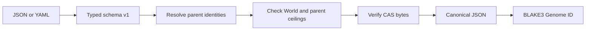

# Genomes

A compiled Genome is an immutable, normalized agent specification. The compiler accepts schema version 1 as strict JSON or YAML, serializes the typed value to canonical compact JSON, and assigns `hephaestus:genome:<blake3>` from those exact bytes. Equivalent JSON and YAML therefore produce one identity.

## Source schema

```json
{
  "schema_version": 1,
  "name": "quickstart-parent",
  "parents": [],
  "model": { "provider": "deterministic", "family": "reference" },
  "authority": { "workspace_write": false, "network": false },
  "artifacts": {}
}
```

| Field | Meaning |
|---|---|
| `schema_version` | Must be `1`. Unknown versions fail closed. |
| `name` | Stable non-blank display name; not part of ancestry. |
| `parents` | Content identities (`hephaestus:genome:<blake3>`) already registered under the same World. Order is normalized. |
| `model` (`provider`, `family`) | Non-blank provider vocabulary. Only `deterministic` / `reference` executes today; hosted providers compile but do not run. |
| `authority.workspace_write`, `authority.network` | Requested capabilities. Must be a subset of the World ceiling and of every parent. |
| `artifacts` | Name to BLAKE3 address map; every address must resolve in the store at compile time. |

Register it with `hephaestus genome register <file> --world <world-id>`; the World is named on the command line, not in the source, so the same source can be compiled under different Worlds and receive different identities. A child that narrows `network: true` to `false` is fine; one that widens it is rejected with the compiler's reason. The working example lives in `examples/quickstart/parent.json` and `examples/quickstart/candidate.template.json`.

## Compilation contract

Compilation rejects unknown fields and schema versions, source documents larger than 1 MiB, blank stable names or model fields, malformed or unverifiable artifact addresses, unresolved parents, spoofed parent lookup keys, and authority wider than either the World or any parent. Parent and objective ordering is normalized before hashing.

Every artifact reference is read from the content-addressed store during compilation. Resolving a filename is insufficient: the bytes must reproduce the declared BLAKE3 address. A released compiled value exposes only read access to its identity, canonical bytes, ancestry, name, and authority.



## Authority inheritance

The World is the outer ceiling. Every declared parent is an additional ceiling. A child may narrow authority but cannot regain a capability removed by any parent; only a future explicit operator-controlled mechanism may authorize widening.
