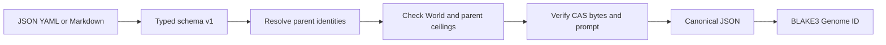

# Genomes

A compiled Genome is an immutable, normalized agent specification. The compiler accepts schema version 1 as strict JSON or YAML, serializes the typed value to canonical compact JSON, and assigns `hephaestus:genome:<blake3>` from those exact bytes. Equivalent JSON and YAML therefore produce one identity. Markdown Genome files use the same schema in a strict YAML frontmatter block followed by a nonblank prompt body; the body bytes are stored in CAS as the reserved agent.prompt artifact and its address is included in the Genome identity.

## Source schema

```json
{
  "schema_version": 1,
  "name": "quickstart-parent",
  "parents": [],
  "model": { "provider": "deterministic", "family": "reference" },
  "authority": { "workspace_write": false, "network": false },
  "artifacts": {}
}
```

| Field | Meaning |
|---|---|
| `schema_version` | Must be `1`. Unknown versions fail closed. |
| `name` | Stable non-blank display name; not part of ancestry. |
| `parents` | Content identities (`hephaestus:genome:<blake3>`) already registered under the same World. Order is normalized. |
| `model` (`provider`, `family`) | Non-blank provider vocabulary. Only `deterministic` / `reference` executes today; hosted providers compile but do not run. |
| `authority.workspace_write`, `authority.network` | Requested capabilities. Must be a subset of the World ceiling and of every parent. |
| `artifacts` | Name to BLAKE3 address map; every address must resolve in the store at compile time. |

Register it with `hephaestus genome register <file> --world <world-id>`; the World is named on the command line, not in the source. The World is a compilation and registration constraint, but its ID is not part of the Genome content identity. The same canonical Genome therefore cannot be registered under a different World after its first registration. A child that narrows `network: true` to `false` is fine; one that widens it is rejected with the compiler's reason. The working JSON example lives in `examples/quickstart/parent.json` and `examples/quickstart/candidate.template.json`.

## Markdown agent files

Markdown Genomes begin with a standalone `---` delimiter, use the same frontmatter fields shown above, close frontmatter with another standalone `---`, and place the prompt body after the closing delimiter. Unknown fields, duplicate YAML keys, YAML merge keys, blank bodies, an explicit agent.prompt artifact in frontmatter, and files larger than 1 MiB are rejected. The compiler stores the exact nonblank UTF-8 body, including whitespace and final newlines, as agent.prompt. `hephaestus genome prompt <genome-id>` prints the verified body for a registered Genome that has this artifact. The command reads only the reserved artifact referenced by that registered Genome. See `examples/quickstart/agent.md` for a complete source file.

## Offline reference instruction subset

The local reference worker is installed beside `hephaestusd` by default (or selected with `--reference-worker-executable`). It does not execute arbitrary prose or call a hosted model. For execution through this worker, a Genome with the reserved agent.prompt artifact must have exact CAS bytes containing one strict fenced `hephaestus-reference-v1` JSON document, no more than 4 KiB:

````text
```hephaestus-reference-v1
{"schema_version":1,"operation":"ascii_uppercase"}
```
````

The only operations are `identity`, which returns the exact World task input bytes, and `ascii_uppercase`, which applies ASCII uppercase to those bytes. Unknown fields, duplicate keys, unknown versions and operations, malformed fences, and oversized instructions fail closed at execution. Arbitrary nonblank UTF-8 Markdown prompt bodies remain valid stored and inspectable Genome data; they cannot run through this reference worker. The selected operation and task input travel as separate bounded fields, so the instruction does not change the task commitment, seed, environment, or budget. The worker runs as an isolated supervised process. Its executable digest and instruction-language version are included in the paired execution environment identity. A Genome without the reserved agent.prompt artifact uses identity for paired Arena runs; legacy direct `run` on a prompt-free Genome keeps its repository inventory behavior.

Forge currently proposes one bounded mutation: flip the operation in the compact canonical fenced document above. It preserves the original accepted framing, including an optional terminal newline or CRLF, and changes only the operation token. Other valid JSON whitespace layouts and arbitrary prose are outside this Forge mutation scope. A proposal is rejected while evolution is frozen; operators must explicitly unfreeze before requesting one. Forge proposals do not authorize promotion.

These operations are a deterministic reference-language slice. They do not demonstrate general prompt understanding, arbitrary agent code, or hosted-provider execution.

## Operator-directed Forge prompt proposals

A registered candidate with a supported agent.prompt can produce one proposal through the authenticated daemon command:

```sh
hephaestus genome propose <proposal-id> \
  --selection-event <selection-event-id> \
  --parent <selected-candidate-genome-id> \
  --hypothesis "State the expected behavior change and why it should help."
```

The daemon re-verifies the exact selection event, receipt, registered World, and selected candidate. It accepts only a strict `hephaestus-reference-v1` prompt and proposes one operation flip between `identity` and `ascii_uppercase`. The child goes through the ordinary Genome compiler and registry with the selected candidate as its sole parent. One `forge.proposed` ledger event binds the selection event hash, hypothesis, parent and child identities, and exact before/after prompt artifact addresses; startup and explicit replay recompute those bindings. Reusing the proposal ID with identical content returns the original event; conflicting content fails closed.

This is operator-directed hypothesis capture and a single deterministic mutation proposal. The current aggregate selection receipt contains no task-level failure clusters, so this command does not infer hypotheses from clusters. It does not evaluate, select, or promote the child, and its response always reports `promotion_eligible=false`.

## Compilation contract

Compilation rejects unknown fields and schema versions, source documents larger than 1 MiB, blank stable names or model fields, malformed or unverifiable artifact addresses, unresolved parents, spoofed parent lookup keys, and authority wider than either the World or any parent. Parent and objective ordering is normalized before hashing.

Every artifact reference is read from the content-addressed store during compilation. Resolving a filename is insufficient: the bytes must reproduce the declared BLAKE3 address. A released compiled value exposes only read access to its identity, canonical bytes, ancestry, name, and authority.



## Authority inheritance

The World is the outer ceiling. Every declared parent is an additional ceiling. A child may narrow authority but cannot regain a capability removed by any parent; only a future explicit operator-controlled mechanism may authorize widening.
