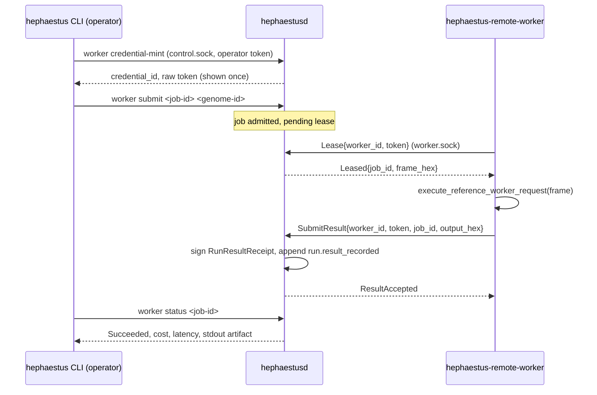

# Remote Workers

Authenticated remote execution of one isolated job kind: a bounded direct
reference run. The daemon remains the sole canonical writer and the sole
holder of the Ed25519 result-signing key; a remote worker only executes the
existing isolated sandboxed transform and returns raw bytes for the daemon
to sign and record.

## Architecture



`hephaestusd` binds a second owner-only Unix socket, worker.sock (mode
`0600`, alongside control.sock), served from the same single-writer
thread as the operator socket — a lease and a canonical write never race a
concurrent operator command.

## Scoped, expiring credentials

`hephaestus worker credential-mint <worker-id> --ttl-seconds <n>` (an
ordinary authenticated operator command over control.sock) mints a
256-bit random secret. The daemon never stores the raw secret: it ledgers
`worker.credential_minted` with `credential_id = blake3(secret)[..32]` (a
public, safe-to-log identity), `worker_id`, `scope`
(`remote_reference_run` — the only scope this slice defines), and
`expires_at_millis`. The raw token is returned to the operator exactly
once, to distribute out of band (an environment variable, a secrets
manager, `scp` — whatever the deployment already uses for credential
distribution).

`hephaestus worker credential-revoke <credential-id>` ledgers
`worker.credential_revoked`; a revoked or expired credential fails closed
at the next `Lease` or `SubmitResult` — verification is a pure function of
replayed history (`ControlState::worker_credentials`), so revocation and
expiry are correct across a daemon restart with no additional state.

## Mutual authentication

- **Worker → daemon**: every `WorkerRequest` (`Lease`, `SubmitResult`)
  carries `{worker_id, token}`. The daemon recomputes
  `blake3(token)[..32]` and checks it against a live, non-revoked,
  non-expired credential bound to that exact `worker_id`. This is checked
  before any lease or result work happens; a bad, wrong, revoked, or
  expired credential returns `WorkerReply::Error` and nothing is
  recorded.
- **Daemon → worker**: worker.sock is an owner-only (`0600`) Unix domain
  socket inside the daemon's own data directory — the same trust model
  `docs/CONTROL_PLANE.md` already establishes for control.sock and
  operator.token. A worker that can open that path is, by construction,
  running as the daemon's owner or has been handed access to it
  deliberately; that is this slice's proof of daemon identity. Extending
  this to a real network deployment (a TCP listener across hosts) would
  need TLS with a pinned daemon certificate in addition to the credential
  check above — out of scope here, and loopback Unix sockets satisfy the
  roadmap's "loopback TCP or Unix socket is fine for tests."

## Isolated sandboxed execution, reused exactly

A remote worker does not reimplement the sandbox. `hephaestus-remote-worker`
calls `hephaestus_runtime::execute_reference_worker_request`, the exact
same pure, no-filesystem, no-network function the local
`hephaestus-reference-worker` binary invokes as a subprocess under the
process guardian (`crates/hephaestus-runtime/src/reference_instruction.rs`).
The daemon builds the identical framed request
(`frame_reference_instruction`) it would otherwise pipe to a local
subprocess, and instead hands the frame to a leased remote worker over the
authenticated channel. The isolated transform itself is transport-agnostic;
only where it runs changes.

## Signing and idempotent duplicate delivery

The worker never signs anything — it has no key. On `SubmitResult`, the
daemon:

1. Verifies the credential (see above).
2. Looks up the job's admission record (`RemoteJobRecord`, ledgered by
   `RemoteRunSubmit` as `remote_worker.job_admitted`).
3. **If `run_results` already contains a signed result for this job's
   `run_id`, returns `ResultAccepted` immediately without reprocessing or
   re-ledgering anything.** This is the idempotent-duplicate-delivery
   guarantee: a worker that retries after a dropped acknowledgement, or two
   workers racing the same lease, can never produce two signed results or
   two ledger events for one job.
4. Otherwise stores the output bytes in the content-addressed artifact
   store, builds a `RunResultReceipt`, signs it with the daemon's own
   `RunResultSigner` (the identical signing path local runs use — see
   `crates/hephaestus-experience/src/run_result.rs`), and appends it as an
   ordinary `run.result_recorded` event. A remote result is therefore
   byte-for-byte indistinguishable in canonical history from a local one.

Leases themselves are **not** ledgered — they are advisory, in-memory
state (`ControlPlane::remote_leases`) with a 60-second timeout, so a worker
that disappears mid-lease simply lets another worker (or the same one,
retrying) pick the job back up. Only admission and the final signed result
are canonical; this keeps a lost or crashed worker from wedging a job.

## Operator CLI

```sh
hephaestus worker credential-mint <worker-id> --ttl-seconds 3600
hephaestus worker credential-revoke <credential-id>
hephaestus worker submit <job-id> <genome-id>
hephaestus worker status <job-id>
```

```sh
hephaestus-remote-worker --data-dir "$HEPHAESTUS_HOME" \
  --worker-id worker-1 --token <hex-secret>
```

(`--token` may also come from `HEPHAESTUS_WORKER_TOKEN`.) Pass `--once` to
attempt a single lease and exit — used by scripted tests.

## Storage backend abstraction

`hephaestus-ledger::{EventLedger, ArtifactBackend}`
(`crates/hephaestus-ledger/src/storage.rs`) name the exact operations the
control plane needs from the canonical ledger and the artifact store. The
existing SQLite-backed `EventStore` and filesystem-backed `ArtifactStore`
implement these traits with no behavior change, and
`storage::storage_contract` proves that implementation against a
backend-agnostic contract test suite (append/replay/duplicate-rejection for
the ledger; put/get/digest-verification for artifacts). A second backend
can implement the same two traits and be proven with the same suite
without changing any domain semantics in `hephaestus-control`,
`hephaestus-arena`, or `hephaestus-genome`. **This slice introduces the
trait boundary and proves the existing backend against it; `ControlPlane`'s
internal call sites still use the concrete `EventStore`/`ArtifactStore`
types directly** (migrating them is mechanical but out of scope here — see
the tech-debt note in the final report).

## Not in this slice

- Only one job kind — a bounded direct reference run. Leasing one Arena
  trial is not implemented.
- No crash recovery for an in-flight lease beyond its 60-second timeout;
  a killed daemon simply loses the (non-canonical) lease table and any
  pending job becomes leasable again on restart.
- `ControlPlane`'s local read/write call sites are not migrated onto the
  new `EventLedger`/`ArtifactBackend` traits.
