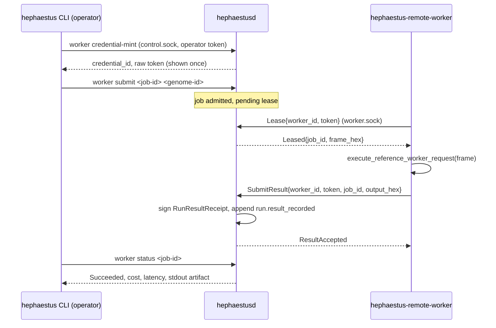

# Remote Workers

Authenticated remote execution of two job kinds: a bounded direct
reference run, and (as of this lane) one reference-role trial of a paired
Arena evaluation admitted with the remote opt-in. The daemon remains the
sole canonical writer and the sole holder of the Ed25519 result-signing
key; a remote worker only executes the existing isolated sandboxed
transform and returns raw bytes for the daemon to sign and record.

## Architecture



`hephaestusd` binds a second owner-only Unix socket, worker.sock (mode
`0600`, alongside control.sock), served from the same single-writer
thread as the operator socket — a lease and a canonical write never race a
concurrent operator command.

## Scoped, expiring credentials

`hephaestus worker credential-mint <worker-id> --ttl-seconds <n>` (an
ordinary authenticated operator command over control.sock) mints a
256-bit random secret. The daemon never stores the raw secret: it ledgers
`worker.credential_minted` with `credential_id = blake3(secret)[..32]` (a
public, safe-to-log identity), `worker_id`, `scope`
(`remote_reference_run` — the only scope this slice defines), and
`expires_at_millis`. The raw token is returned to the operator exactly
once, to distribute out of band (an environment variable, a secrets
manager, `scp` — whatever the deployment already uses for credential
distribution).

`hephaestus worker credential-revoke <credential-id>` ledgers
`worker.credential_revoked`; a revoked or expired credential fails closed
at the next `Lease` or `SubmitResult` — verification is a pure function of
replayed history (`ControlState::worker_credentials`), so revocation and
expiry are correct across a daemon restart with no additional state.

## Mutual authentication

- **Worker → daemon**: every `WorkerRequest` (`Lease`, `SubmitResult`)
  carries `{worker_id, token}`. The daemon recomputes
  `blake3(token)[..32]` and checks it against a live, non-revoked,
  non-expired credential bound to that exact `worker_id`. This is checked
  before any lease or result work happens; a bad, wrong, revoked, or
  expired credential returns `WorkerReply::Error` and nothing is
  recorded.
- **Daemon → worker**: worker.sock is an owner-only (`0600`) Unix domain
  socket inside the daemon's own data directory — the same trust model
  `docs/CONTROL_PLANE.md` already establishes for control.sock and
  operator.token. A worker that can open that path is, by construction,
  running as the daemon's owner or has been handed access to it
  deliberately; that is this slice's proof of daemon identity. Extending
  this to a real network deployment (a TCP listener across hosts) would
  need TLS with a pinned daemon certificate in addition to the credential
  check above — out of scope here, and loopback Unix sockets satisfy the
  roadmap's "loopback TCP or Unix socket is fine for tests."

## Isolated sandboxed execution, reused exactly

A remote worker does not reimplement the sandbox. `hephaestus-remote-worker`
calls `hephaestus_runtime::execute_reference_worker_request`, the exact
same pure, no-filesystem, no-network function the local
`hephaestus-reference-worker` binary invokes as a subprocess under the
process guardian (`crates/hephaestus-runtime/src/reference_instruction.rs`).
The daemon builds the identical framed request
(`frame_reference_instruction`) it would otherwise pipe to a local
subprocess, and instead hands the frame to a leased remote worker over the
authenticated channel. The isolated transform itself is transport-agnostic;
only where it runs changes.

## Signing and idempotent duplicate delivery

The worker never signs anything — it has no key. On `SubmitResult`, the
daemon:

1. Verifies the credential (see above).
2. Looks up the job's admission record (`RemoteJobRecord`, ledgered by
   `RemoteRunSubmit` as `remote_worker.job_admitted`).
3. **If `run_results` already contains a signed result for this job's
   `run_id`, returns `ResultAccepted` immediately without reprocessing or
   re-ledgering anything.** This is the idempotent-duplicate-delivery
   guarantee: a worker that retries after a dropped acknowledgement, or two
   workers racing the same lease, can never produce two signed results or
   two ledger events for one job.
4. Otherwise stores the output bytes in the content-addressed artifact
   store, builds a `RunResultReceipt`, signs it with the daemon's own
   `RunResultSigner` (the identical signing path local runs use — see
   `crates/hephaestus-experience/src/run_result.rs`), and appends it as an
   ordinary `run.result_recorded` event. A remote result is therefore
   byte-for-byte indistinguishable in canonical history from a local one.

Leases themselves are **not** ledgered — they are advisory, in-memory
state (`ControlPlane::remote_leases`) with a 60-second timeout, so a worker
that disappears mid-lease simply lets another worker (or the same one,
retrying) pick the job back up. Only admission and the final signed result
are canonical; this keeps a lost or crashed worker from wedging a job.

## Leasing an Arena trial

`hephaestus arena evaluate --remote` (equivalently, `submit_arena_job(...,
remote: true)`) admits a paired evaluation with a per-evaluation remote
opt-in recorded in its `ArenaJobRecord`. With the opt-in set, every
reference-role trial (a role/task pair with no provider bound) is leased to
a remote worker one at a time, in admitted order, instead of running in a
local sandbox; a provider-bound trial in a mixed pair still always runs
locally, since a remote worker only ever executes the same deterministic,
no-filesystem, no-network reference transform a direct run does.

The background thread that would otherwise call
`hephaestus_runtime::execute_reference_worker_request` locally instead
blocks on `RemoteArenaLeaseQueue::submit_and_wait` (never the daemon's
single control-loop thread), registering the trial's identity as
`arena:<evaluation_id>:trial:<index>` and its exact framed request — the
same `frame_reference_instruction` construction the direct-run path uses.
The daemon's existing worker.sock loop serves it from `lease_remote_job`
and `record_remote_job_result` — the exact same handlers a direct-run job
uses — so a remote worker cannot tell an Arena trial apart from a direct
reference run, and `hephaestus-remote-worker` needed no changes at all.
Once a worker submits a result, the daemon signs and records it through
the identical `run.result_recorded` path a local trial takes, so the
resulting selection receipt is indistinguishable from one computed
entirely locally (proven by
`remote_leased_arena_trial_matches_local_execution_and_is_idempotent_under_duplicate_delivery`
in `crates/hephaestus-control/src/server_tests.rs`, which asserts the same
`SelectionReceipt` decision fields for a remote-leased evaluation and the
identical pair evaluated locally — every field except the two measured
latencies and the latency-derived `candidate_pareto_dominates`, which are
expected to differ between a local sandbox run and a leased round trip).

Everything else about the lease queue mirrors the direct-run path:
`Lease`/`SubmitResult` both re-verify the worker credential before doing
anything, so an expired or revoked credential fails closed before a trial
is leased or a result recorded and leaves the Arena job pending (not
failed) until an operator lease becomes available again or the job is
cancelled; duplicate delivery of an already-completed trial's result stays
idempotent (the queue remembers completed trial identities); a lease that
times out (`REMOTE_LEASE_TIMEOUT`, 60 s) simply becomes leasable again; and
operator cancellation or the evaluation's overall deadline still
terminalizes the job exactly like a local trial would, because both set
the same `cancel` flag `submit_and_wait` polls. None of this is ledgered
directly — like `remote_leases`, the lease queue is ephemeral, in-memory
state; only admission (including the `remote` opt-in) and each trial's
final signed result are canonical.

## Operator CLI

```sh
hephaestus worker credential-mint <worker-id> --ttl-seconds 3600
hephaestus worker credential-revoke <credential-id>
hephaestus worker submit <job-id> <genome-id>
hephaestus worker status <job-id>
```

```sh
hephaestus-remote-worker --data-dir "$HEPHAESTUS_HOME" \
  --worker-id worker-1 --token <hex-secret>
```

(`--token` may also come from `HEPHAESTUS_WORKER_TOKEN`.) Pass `--once` to
attempt a single lease and exit — used by scripted tests.

## Testing

Besides the in-process tests in `crates/hephaestus-control/src/server_tests.rs`, `crates/hephaestus-control/tests/control_plane_e2e.rs`'s `remote_worker_binary_round_trips_duplicates_and_fails_closed_on_bad_credentials` spawns the real `hephaestus-remote-worker` binary against a real daemon and drives a full lease/result round trip, a hand-replayed duplicate delivery, an expired credential, a revoked credential, and a malformed/oversized worker.sock message end to end.

## Storage backend abstraction

`hephaestus-ledger::{EventLedger, ArtifactBackend}`
(`crates/hephaestus-ledger/src/storage.rs`) name the exact operations the
control plane needs from the canonical ledger and the artifact store. The
SQLite-backed `EventStore`/filesystem-backed `ArtifactStore` and the
JSONL-backed `FileEventLedger`/in-process `MemoryArtifactBackend` all
implement these traits, and `storage::storage_contract` proves all four
against a backend-agnostic contract test suite (append/replay/duplicate-
rejection for the ledger; put/get/digest-verification for artifacts).
`ControlPlane`'s canonical storage (`crates/hephaestus-control/src/server.rs`)
is now routed through these traits rather than the concrete types — see
`docs/LEDGERS.md` for the daemon-facing details of what changed and what
did not.

## Not in this slice

- No crash recovery for an in-flight lease beyond its 60-second timeout;
  a killed daemon simply loses the (non-canonical) lease table and any
  pending job becomes leasable again on restart.
- A remote worker leasing an Arena trial and a remote worker leasing a
  direct run share one credential/lease vocabulary, but there is still no
  way to reserve a worker for one job kind only, or to run several Arena
  trials of the same evaluation concurrently across several remote
  workers — trials are leased strictly one at a time, in admitted order.
- No CI job or measured coverage yet for `hephaestus-mcp-gateway` or
  `hephaestus-remote-worker`, including the new Arena-trial-lease code
  paths (`TECH_DEBT.md` TD-19).
