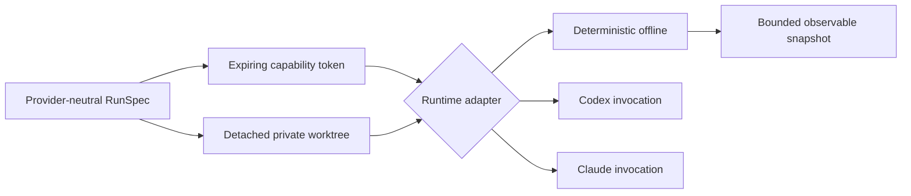

# Runtimes and Sandboxes

`crates/hephaestus-runtime/` keeps provider mechanics outside Genome semantics. Every `RunSpec` binds a Genome, World, exact task input, source repository, resolved Git commit, explicit capabilities, non-zero wall and output budgets, and cost ceiling. An optional reference instruction is a separate immutable field; it never replaces or alters the task input or its BLAKE3 commitment. Arena runs derive the environment identity from the runtime version, instruction-language version, OS/architecture/isolation identity, and digest of the configured worker executable. The worker accepts a bounded binary frame and implements only the strict `identity` and `ascii_uppercase` operations described in [GENOMES.md](GENOMES.md). It runs under `SupervisedRuntime` and the same wall/output limits. The revision is resolved once when the specification is created, so later branch movement cannot change the evaluated source. The sandbox manager creates a private detached worktree at that commit, a separate execution directory, and a non-cloneable 256-bit capability token bound to the run and an expiry.

## Lifecycle contract

Adapters report enforceable capabilities and implement start, resume, interrupt, and snapshot. Snapshots expose status, an exact supervisor-owned completion reason, measured elapsed time, exit code, bounded stdout/stderr artifact paths, and assigned authority—never hidden chain-of-thought. Adapters expose typed provider-visible observations separately from lifecycle state. The deterministic adapter inventories tracked regular files by path, size, and BLAKE3 hash inside the worktree and emits context, file-read, and response metadata. Resume is accepted only for an existing non-running run and replaces prior state only after capability validation succeeds. The adapter provides a non-billable reference path for CI and fails on network widening, expired or cross-run tokens, and output-budget overflow.

## Hosted drivers

Codex and Claude Code invocation builders are pinned to the locally inspected non-interactive CLI contracts. Prompts travel over stdin rather than the process list. Codex uses ephemeral mode, a workspace-derived sandbox mode, and explicit network policy. Claude uses safe mode, no session persistence, explicit tools, `dontAsk`, streaming JSON, and a six-decimal hard cost ceiling.

The builders are deliberately inert in this checkpoint. Live hosted execution may consume paid quota or credentials and therefore requires a separate explicit execution permit. On macOS, provider commands run through a deny-by-default Seatbelt profile: the active run root is the only writable subtree, sibling worktrees and canonical protected paths are unreadable, and network is denied unless the compiled capability allows it. Hosts without a verified backend fail closed.

The non-billable process supervisor proves the shared lifecycle mechanics with real local helpers. Its constructor requires an `IsolationPolicy`, and the production launch path cannot construct a child command without that policy. Every adapter rejects a specification whose repository or pinned commit differs from the materialized sandbox. It starts each child in its own process group and allowlisted environment, requires complete prompt delivery through stdin, drains stdout and stderr concurrently into one combined byte ceiling, enforces the wall deadline independently of callers, kills descendants on interrupt, and exposes bounded artifact paths plus exact terminal state. A partial or failed stdin write is an I/O failure even when the child exits zero. Sandbox creation uses an armed rollback guard so Git spawn, checkout, permission, or entropy failure attempts both Git worktree-registration cleanup and private run-directory removal; if either compensating step fails, the runtime reports the incomplete rollback explicitly. Credential mediation, verified provider-specific resume, and a hard Codex cost limiter remain prerequisites before hosted builders can become active adapters.

`IsolatedWorker` applies the same process-group monitor to synchronous candidate and evaluator helpers. Each request declares its trust domain, runs offline in a distinct owner-only root with an allowlisted environment, streams bounded stdin, captures one combined bounded stdout/stderr result, enforces a monotonic wall deadline, and removes its private files before returning on success or failure. Trusted callers supply canonical and evaluator paths to `IsolationPolicy`; the production worker refuses to launch when no verified OS backend is available. The unconfined constructor exists only behind the opt-in `test-support` feature for cross-platform contract tests and is absent from ordinary release builds.
