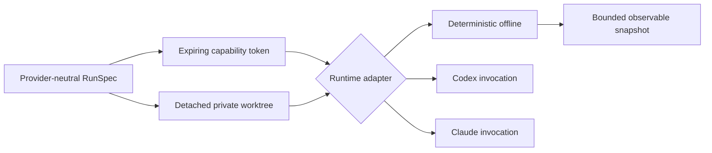

# Runtimes and Sandboxes

`crates/hephaestus-runtime/` keeps provider mechanics outside Genome semantics. Every `RunSpec` binds a Genome, World, exact task input, source repository, resolved Git commit, explicit capabilities, non-zero wall and output budgets, and cost ceiling. An optional reference instruction is a separate immutable field; it never replaces or alters the task input or its BLAKE3 commitment. Arena runs derive the environment identity from the runtime version, instruction-language version, OS/architecture/isolation identity, and digest of the configured worker executable (or, for a provider-adapter role, the configured Codex/Claude executable's own digest instead — see "Hosted drivers" below). The worker accepts a bounded binary frame and implements only the strict `identity` and `ascii_uppercase` operations described in [GENOMES.md](GENOMES.md). It runs under `SupervisedRuntime` and the same wall/output limits. The revision is resolved once when the specification is created, so later branch movement cannot change the evaluated source. The sandbox manager creates a private detached worktree at that commit, a separate execution directory, and a non-cloneable 256-bit capability token bound to the run and an expiry.

## Lifecycle contract

Adapters report enforceable capabilities and implement start, resume, interrupt, and snapshot. Snapshots expose status, an exact supervisor-owned completion reason, measured elapsed time, exit code, bounded stdout/stderr artifact paths, and assigned authority—never hidden chain-of-thought. Adapters expose typed provider-visible observations separately from lifecycle state. The deterministic adapter inventories tracked regular files by path, size, and BLAKE3 hash inside the worktree and emits context, file-read, and response metadata. Resume is accepted only for an existing non-running run and replaces prior state only after capability validation succeeds. The adapter provides a non-billable reference path for CI and fails on network widening, expired or cross-run tokens, and output-budget overflow.

## Hosted drivers

Codex and Claude Code invocation builders (`crates/hephaestus-runtime/src/provider.rs`) are pinned to the current documented non-interactive CLI contracts, cited below rather than guessed. `SupervisedRuntime::provider`/`provider_guarded` (`crates/hephaestus-runtime/src/supervisor.rs`) select the invocation builder by `Provider`, run it under exactly the same process-group supervisor, wall/output budgets, and `IsolationPolicy` as the reference worker, and implement `RuntimeAdapter::drain_observations` by feeding new stdout bytes through `ProviderEventCursor` (`crates/hephaestus-runtime/src/provider_events.rs`), which maps each provider's NDJSON event stream onto the provider-neutral `RuntimeObservation` contract.

**Codex** (`codex exec`): non-interactive JSON events via `--json`; the prompt is read from stdin with the literal `-` argument; `--ephemeral` skips persisting session rollout files; `--ignore-user-config` skips `$CODEX_HOME/config.toml`; `--sandbox workspace-write|read-only` follows the Genome's workspace-write capability; `--cd <dir>` pins the working directory; `-c sandbox_workspace_write.network_access=<bool>` follows the Genome's network capability; `codex exec` already defaults to `approval_policy = "never"`, so there is no interactive-approval flag to add. Event types consumed: `item.started`/`item.completed` (with an item type field of `agent_message`, `command_execution`, `mcp_tool_call`, or `file_change`), `turn.completed` (carries `usage`: `input_tokens`, `cached_input_tokens`, `output_tokens`, `reasoning_output_tokens` — Codex does not report a USD figure, so `actual_cost_microusd` is always `0` for Codex and only the token counts are recorded as trace fields), and a failed-turn event (carries `error`, recorded as a denial/error observation). Sources: [Non-interactive mode](https://learn.chatgpt.com/docs/non-interactive-mode), [Developer commands / CLI reference](https://learn.chatgpt.com/docs/developer-commands?surface=cli), [Advanced Configuration (`sandbox_workspace_write.network_access`)](https://developers.openai.com/codex/config-advanced).

**Claude Code** (`claude -p`, print/headless mode): `--print` runs non-interactively; `--output-format stream-json` with `--verbose` streams one JSON message per line (`assistant`/`user` messages with `tool_use`/`tool_result` content blocks, `system` messages including `subtype: "init"` and, when nothing can approve a call, `subtype: "permission_denied"`, and a terminal `result` message carrying `result` (the final answer text) and `total_cost_usd`); `--permission-mode dontAsk` denies anything that would otherwise prompt while still auto-approving explicitly allowed tools; `--permission-prompts none` tells Claude not to retry a denied call (requires Claude Code v2.1.259+); `--tools <list>` restricts the available tool set to `Read` (read-only Genomes) or `Read,Edit,Write` (workspace-write Genomes) — the opposite selection from `--allowedTools`; `--setting-sources ""`, `--strict-mcp-config`, and `--disable-slash-commands` stop the nested session from loading this operator's own hooks, MCP servers, skills, or commands. `--bare` is **never** used for this nested call: on a subscription login it never reads OAuth credentials or the system keychain, requires `ANTHROPIC_API_KEY` instead, and fails closed with "Not logged in" without it. Subagent messages (`parent_tool_use_id` non-null) are recorded as a `SubagentSpawned` observation carrying the parent tool-use id; full subagent transcript reconstruction (`--forward-subagent-text`) is not implemented. Because the genome's Markdown prompt body can be arbitrarily large while process argument lists have a platform-dependent size limit, the prompt travels on stdin (the documented "pipe data through Claude" pattern) and a short fixed instruction on argv tells Claude to read it there. Sources: [Run Claude Code programmatically](https://code.claude.com/docs/en/headless), [CLI reference](https://code.claude.com/docs/en/cli-reference).

Provider selection is Genome configuration (`model.provider: codex|claude|deterministic` in the compiled Genome, `CompiledGenome::model_provider()`), never a code branch keyed on the model family: the daemon (`hephaestus-control`) reads it once per run and picks an adapter without changing anything else about the `RunSpec`/evidence pipeline. The Codex and Claude binaries themselves are operator configuration — `HEPHAESTUS_CODEX_EXECUTABLE` / `HEPHAESTUS_CLAUDE_EXECUTABLE` environment variables on the daemon process, defaulting to `codex`/`claude` resolved on `PATH` — so offline tests point them at small fake scripts and a live operator points them at their own install. No environment variable beyond the adapter's fixed `PATH`/`HOME`/`TMPDIR` baseline reaches the child unless it is explicitly named in `HEPHAESTUS_PROVIDER_ENV_ALLOWLIST` (comma-separated names); this is how a real `ANTHROPIC_API_KEY`/`OPENAI_API_KEY`/`CODEX_API_KEY` would be made available for a live run, and it is never inherited implicitly.

Mapping to a signed run result: `execute_provider_runtime` (`crates/hephaestus-control/src/server.rs`) reads the terminal run's bounded stdout, extracts the final answer with `extract_final_answer` (Codex: the last `agent_message` item's text; Claude: the terminal `result` message's `result` field) and the reported cost with `extract_actual_cost_microusd` (Claude's `total_cost_usd`, converted to micro-US-dollars; Codex always `0`), then redacts both the extracted stdout and the raw stderr text through `RedactionPolicy::redact_text` — the same secret-redaction policy (`crates/hephaestus-experience/src/redaction.rs`) already used for structured trace fields — before either ever reaches the content-addressed artifact store. `RunResultReceipt.actual_cost_microusd` (`crates/hephaestus-experience/src/run_result.rs`) is bounded by the receipt's own approved budget rather than hard-coded to zero; the reference worker and a provider stream that reports nothing keep reporting `0`. Structured observations (tool calls/results, denials, cost, subagent linkage) flow through the existing `RecordedRuntime`/`EvidenceRecorder` pipeline exactly as the reference worker's do, so they are redacted and content-addressed the same way. Genome semantics never see provider details: `RunSpec`, `CapabilitySet`, and the trace/evidence types are identical regardless of which adapter ran.

This wiring covers `run` (`RunReference`), synchronous `RunEvaluation`, `submit` (`RunSubmit`, the async job path), and Arena paired evaluation (`arena evaluate`) end to end for a `codex`/`claude` Genome. Every admission record — `RunSpec`'s `ExperimentContext`, the async `JobRecord`, and the Arena `ArenaJobRecord` — carries a versioned environment identity: `reference-v1.<digest>` for the reference worker (a BLAKE3 digest of the runtime/schema/OS/arch identity and the pinned worker binary's own digest) or `provider-v1.<digest>` for a Codex/Claude adapter (the same shape, but binding the provider name and the exact configured executable's digest instead). `validate_job_record` (`crates/hephaestus-control/src/server.rs`) accepts either shape for `submit`, checking it against the target Genome's own `model.provider` and bounding the cost budget by the Genome's registered World Law instead of a fixed zero when the shape is provider-shaped; the task id, input, and seed stay the fixed reference-inventory contract for both shapes, matching what the synchronous path already proves works for a provider Genome. `validate_arena_job_record`/`apply_arena_job_record` do the same for `ArenaJobRecord`, independently per role: a parent and candidate may each be reference- or provider-shaped, and a **mixed pair** (for example, a reference-worker parent compared against a provider-adapter candidate) is admitted only when the World's Law sets `laws.allow_mixed_environments: true` (default `false`); the admission record then carries both environments (`environment_id` for the parent, `candidate_environment_id` for the candidate) and the sealed per-evaluation receipt bumps its `schema_version` from 2 to 3 to carry the second identity, while every previously recorded homogeneous receipt keeps schema 2 and verifies byte-for-byte unchanged. Selection, Forge assessment, invariants, Champion, evolve, canary, and Gene transfer all consume this same Arena evidence, so a provider Genome is first-class evidence for every one of them without further plumbing.

The reference worker's private snapshot (`PinnedReferenceWorker`, `ControlPlane::pin_reference_worker` in `crates/hephaestus-control/src/server.rs`) is pinned exactly once per daemon lifetime, not once per run: the first direct reference run, synchronous `RunEvaluation`, `submit` admission, or Arena admission reads the configured reference worker executable, checks its digest against the one captured at daemon startup, writes a single private, read-only (`0o500`) copy into a fresh `TempDir` under the data directory, and caches the result as a shared `Arc` on the `ControlPlane`. Every later call reuses that same `Arc` — including `submit_arena_job`, which still unconditionally fetches the pin for every Arena admission, even an all-provider pair that never executes it (see `TECH_DEBT.md` TD-15) — instead of writing and tearing down a fresh private copy per call. Reuse is not unconditional trust: before each use, the cached copy is re-hashed and compared against the digest captured at pin time (`PinnedReferenceWorker::verify`); a mismatch fails that call closed with the existing "pinned reference worker identity changed" rejection and drops the cache entry so the next call pins a fresh snapshot rather than silently reusing (or being stuck permanently refusing) a tampered one. Because execution only ever reads from the private snapshot, replacing the *public* deployed reference worker binary after the daemon has already pinned it has no effect on later runs in that daemon's lifetime — the daemon keeps working from its own already-verified copy; only the very first pin (or a re-pin after a corrupted cache entry is dropped) re-checks the public path against the digest recorded at daemon startup.

On macOS, provider commands run through the same deny-by-default Seatbelt profile as every other worker: the active run root is the only writable subtree, sibling worktrees and canonical protected paths are unreadable, and network is denied unless the compiled capability allows it. Hosts without a verified backend fail closed. A live run against the real `codex`/`claude` CLI is opt-in and documented, not automatic — see "Live smoke test" below.

The process supervisor (`crates/hephaestus-runtime/src/supervisor.rs`) proves the shared lifecycle mechanics identically for the reference worker and for Codex/Claude. Its constructor requires an `IsolationPolicy`, and the production launch path cannot construct a child command without that policy. Every adapter rejects a specification whose repository or pinned commit differs from the materialized sandbox. It starts each child in its own process group and allowlisted environment, requires complete prompt delivery through stdin, drains stdout and stderr concurrently into one combined byte ceiling, enforces the wall deadline independently of callers, kills descendants on interrupt, and exposes bounded artifact paths plus exact terminal state. A partial or failed stdin write is an I/O failure even when the child exits zero. Sandbox creation uses an armed rollback guard so Git spawn, checkout, permission, or entropy failure attempts both Git worktree-registration cleanup and private run-directory removal; if either compensating step fails, the runtime reports the incomplete rollback explicitly. Provider-specific resume (`codex exec resume`, `claude --resume`) is not implemented; `RuntimeAdapter::resume` on a Codex/Claude `SupervisedRuntime` fails closed with `RuntimeError::Unsupported`, the same as it always has for the reference path.

`IsolatedWorker` applies the same process-group monitor to synchronous candidate and evaluator helpers. Each request declares its trust domain, runs offline in a distinct owner-only root with an allowlisted environment, streams bounded stdin, captures one combined bounded stdout/stderr result, enforces a monotonic wall deadline, and removes its private files before returning on success or failure. Trusted callers supply canonical and evaluator paths to `IsolationPolicy`; the production worker refuses to launch when no verified OS backend is available. The unconfined constructor exists only behind the opt-in `test-support` feature for cross-platform contract tests and is absent from ordinary release builds.

## Live smoke test (opt-in, not run by this lane)

Every test in this repository's suite points a Codex/Claude adapter at a small local fake script; none of it invokes the real `codex` or `claude` binary, spends quota, or touches the network. A real end-to-end run against your own installed CLI and credentials is an explicit, separate action the operator takes:

1. Install and authenticate the CLI you want to exercise (`codex` or `claude`) exactly as you normally would; this repository never manages that login for you.
2. Register a Genome whose `model.provider` is `codex` or `claude` (`hephaestus genome register ...`) under a World whose Law's `maximum_cost_microusd` is high enough to cover one real call.
3. If the CLI is not on `PATH` under its default name, set `HEPHAESTUS_CODEX_EXECUTABLE` / `HEPHAESTUS_CLAUDE_EXECUTABLE` to its path before starting `hephaestusd`. If the CLI needs an API key rather than your interactive login, set that key in the daemon's own environment and name it in `HEPHAESTUS_PROVIDER_ENV_ALLOWLIST` (comma-separated) so it is explicitly passed through — nothing else from the daemon's environment reaches the child.
4. Set `HEPHAESTUS_LIVE_PROVIDER_SMOKE=1` in your own shell as a marker that you are knowingly about to spend money; this repository's own checks and CI never set it and never run this step.
5. Run `hephaestus run <genome-id>` and inspect the signed result and traces with `hephaestus runs --limit 1`.

**This may cost real money and requires your own credentials.** No test, mutation job, or CI workflow in this repository sets `HEPHAESTUS_LIVE_PROVIDER_SMOKE` or calls a real provider CLI; a human runs this step deliberately, outside CI.
