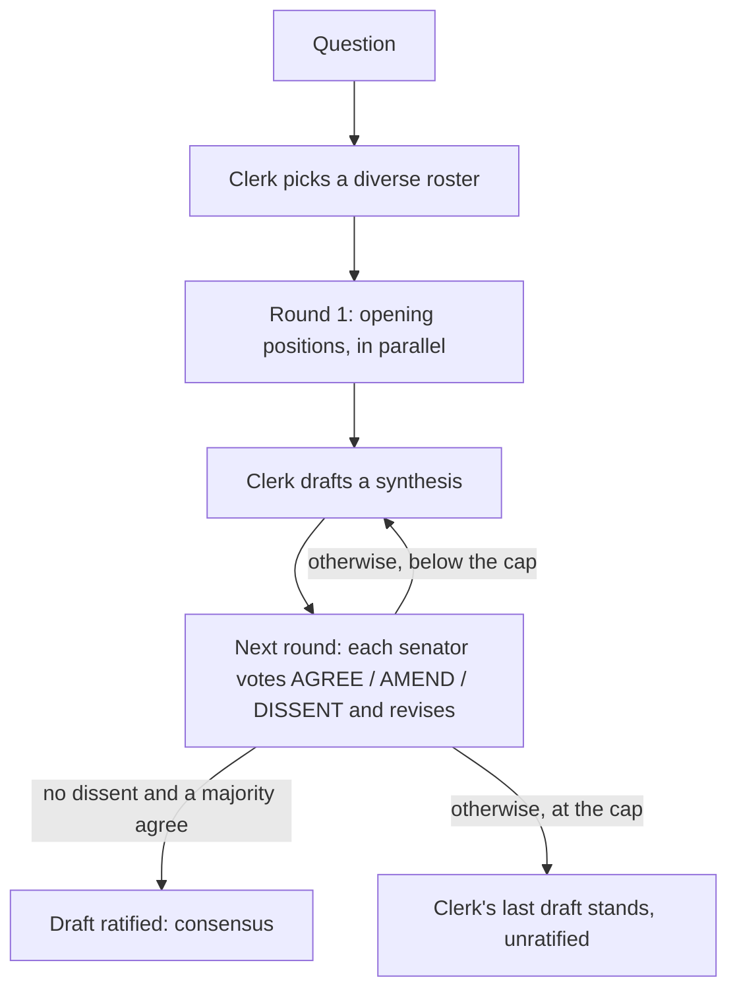

# The Senate

Put a question, idea, or brief to a panel of simulated perspectives and get
back one debated answer. Each senator argues "in the spirit of" a historical
philosopher, scientist, technologist, statesperson, economist, or artist. The
senators debate in rounds until they reach consensus or hit the round cap.
The Senate then prints one synthesized answer, the points of agreement, and
any remaining dissent, credited to the perspective that raised it.

The Senate is standalone. It needs no daemon, TUI, or workers, and it runs on
the model subscription you already have: Claude Code or the Codex CLI.

<p align="center">
  
</p>

> **Disclaimer.** Senators are simulated perspectives written by an AI model
> "in the spirit of" historical figures. Nothing the Senate prints is any real
> person's words, views, or endorsement. Every output carries a one-line
> disclaimer saying so.

## Install

From a source checkout:

```bash
scripts/install.sh --senate-only   # just the `senate` binary
scripts/install.sh --full          # all of Hephaestus, `senate` included
```

With neither flag, `scripts/install.sh` asks "Just here for the Senate?" when
run from a terminal, and does the full install when run non-interactively. The
persona list is compiled into the binary, so nothing else needs installing. On
a first run from a terminal, `heph` asks the same question. A yes tells you how
to use `senate` and does not start a daemon.

## Usage

```bash
senate ask "What is the best way to structure this migration?" --size M
senate ask "I need this architecture document in the best form possible" \
  --context docs/ARCHITECTURE.md --size L --out improved.md
echo "Should we build or buy our billing system?" | senate ask - --size S
senate personas                     # who can sit, and through what lens
hephaestus senate ask "..." --size XL   # same CLI, through the operator binary
```

| Flag | Meaning |
|---|---|
| `--size S\|M\|L\|XL` | How many senators sit and how many rounds they may take (default `M`) |
| `--backend claude\|codex` | Which model CLI to use (default: `SENATE_BACKEND`, else `claude`, else `codex`) |
| `--backend-bin PATH` | The exact executable to run (default: `SENATE_BACKEND_BIN`, else `PATH`) |
| `--context FILE` | Append a file to the question; repeatable |
| `--out FILE` | Also write the final answer to a file |
| `--transcript FILE` | Where to save the full transcript (default: a `transcripts` folder under `SENATE_HOME`, else under `~/.senate`) |
| `--jobs N` | Most model calls in flight at once (default 4) |
| `--seed N` | Seed for the fallback roster (default: derived from the question) |
| `--timeout SECS` | Per-call timeout (default 600) |

The answer goes to stdout, and progress and errors go to stderr. The run
fails with a clear message if neither `claude` nor `codex` is installed.

## Sizes

| Size | Senators | Round cap | Most model calls |
|---|---|---|---|
| S | 3 | 2 | 9 |
| M | 5 | 3 | 19 |
| L | 9 | 4 | 41 |
| XL | 15 | 5 | 81 |

## How a debate runs



1. **Roster.** The model, acting as a neutral clerk, picks senators from the
   curated list in `crates/hephaestus-senate/data/personas.json`. The Senate
   keeps only ids that exist on the list. If the clerk names too few, the
   Senate fills the remaining seats from a seeded roster that draws from each
   domain in turn, so the same question and seed always seat the same Senate.
2. **Openings.** Every senator writes an opening position in parallel. The
   clerk then drafts a synthesis.
3. **Rounds.** Each senator sees the draft and the others' latest positions,
   votes on the draft, and revises their own position. The draft is ratified
   when no one dissents and a strict majority agree. Otherwise the clerk
   redrafts, folding in the amendments.
4. **Output.** The Senate prints the answer, the points of agreement, and the
   last vote's amendments and dissent, each credited to the senator who raised
   it. It also prints how many model calls ran and the wall time. The full
   transcript (roster, every position, vote, and draft) is saved to disk.

Dissent comes from the votes themselves, not from the clerk's summary, so the
model cannot talk it away. If one senator's call fails, the failure goes into
the transcript and the debate continues without them. If every opening fails,
or a clerk draft fails, the run stops with an error.

## Backends and isolation

Each model call is a fresh subprocess of your own CLI. The prompt goes in on
stdin, and the subprocess runs in an empty scratch directory so no project
instructions leak in:

- Claude Code: `claude -p --setting-sources "" --strict-mcp-config --tools ""
  --disable-slash-commands --no-session-persistence`. This loads none of your
  hooks, settings, MCP servers, or skills, so a Senate run inside a hooked
  session cannot recurse. The Senate never passes `--bare`, because that flag
  skips the keychain and breaks subscription sign-in.
- Codex: `codex exec --skip-git-repo-check --ephemeral --ignore-user-config
  --ignore-rules --sandbox read-only`, reading the reply from
  `--output-last-message`.

## Cost and limits

- Every call spends from your own subscription. The size table above gives
  the most calls each size can make. A debate that ratifies early makes fewer.
  From round 2 on, each senator's prompt includes every other senator's latest
  position, so XL prompts are the largest.
- Calls run with bounded concurrency (`--jobs`). If your plan rate-limits, a
  lower `--jobs` trades wall time for fewer rejected calls.
- The Senate is only as good as the model behind it. The personas are lenses
  for widening the debate, not experts, and nothing they say is a citation.
- Tests never run a real model CLI. The contract tests in
  `crates/hephaestus-senate/tests/senate_cli.rs` drive the real binary against
  small fake scripts.
