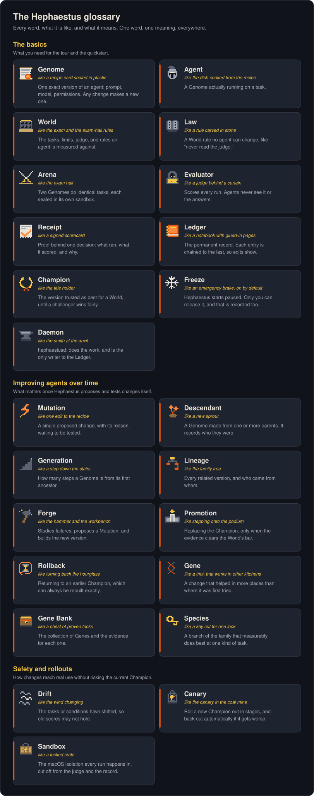

# Glossary

Hephaestus borrows words from biology and ancient Greece because it treats
agent improvement like evolution: versions are born, tested, and only the fit
ones survive. Each word has exactly one meaning everywhere in this project.
Each entry gives an everyday picture first, then the precise definition the
code uses.

  

<strong>The same glossary as searchable text, with the precise definitions the code uses</strong>

## The basics

These are the words you need for the tour and the quickstart.

| Term | Think of it as | Plain meaning | Precise meaning |
|---|---|---|---|
| **Genome** | A recipe card sealed in plastic | One exact version of an agent: its prompt, model, and permissions. Its ID is a fingerprint of its contents, so any change makes a new Genome. | An immutable specification of an agent intelligence configuration |
| **Agent** | The dish cooked from the recipe | A Genome actually running on a task. | A running instance of a Genome |
| **World** | The exam and the exam-hall rules | Everything an agent is measured against: tasks, limits, the judge, and the rules. Change any of it and you get a new World. | A versioned evaluation environment and its Laws |
| **Law** | A rule carved in stone | A rule of a World that no agent can change, such as "agents may never read the judge". | A non-evolvable rule governing a World |
| **Arena** | The exam hall | Where two Genomes do the same tasks under the same conditions, each sealed in its own sandbox. | The protected environment where candidates are evaluated |
| **Evaluator** | A judge behind a curtain | The program that scores runs. Agents never see it or the expected answers. | The World-pinned scoring process, referenced by hash from the World |
| **Evidence receipt** | A signed scorecard | Saved, checkable proof of what ran, what it scored, and why a decision came out the way it did. | Machine-readable proof for a comparison or decision |
| **Ledger** | A notebook with glued-in pages | The permanent record of everything. Each entry is chained to the previous one, so tampering shows. | The hash-linked canonical event ledger |
| **Champion** | The title holder | The version currently trusted as best for one World. | The currently promoted Genome for one lineage and World |
| **Freeze** | An emergency brake, on by default | Hephaestus starts paused and only the operator can release it. | The daemon's durable stop state for new evolution work |
| **Daemon** | The smith at the anvil | `hephaestusd`, the background program and the only thing allowed to write to the Ledger. | The single canonical writer and local control plane |

## Improving agents over time

These words matter once you let Hephaestus propose and test changes itself.

| Term | Think of it as | Plain meaning | Precise meaning |
|---|---|---|---|
| **Mutation** | One edit to the recipe | A single proposed change, with a stated reason, to be tested. | One hypothesized change to a Genome |
| **Descendant** | A new sprout | A new Genome made from one or more existing ones. It records its parents. | A Genome produced from one or more parents |
| **Generation** | A step down the stairs | How far a Genome is from its first ancestor. | Evolutionary depth in an ancestry graph |
| **Lineage** | The family tree | All the versions related to each other, and who came from whom. | The ancestry graph of related Genomes |
| **Forge** | The hammer and the workbench | The part that studies failures, proposes a Mutation, and builds the new version. | Failure analysis, mutation, and descendant generation |
| **Promotion** | Stepping onto the podium | Replacing the Champion, and only when the evidence clears the World's bar. | Deterministic Champion replacement supported by evidence |
| **Rollback** | Turning back the hourglass | Returning to an earlier Champion, which can always be rebuilt exactly. | Reversion to a reconstructable prior Champion |
| **Gene** | A trick that works in other kitchens | A change that has helped in more than the place it was first tried. | A mutation with evidence supporting reuse beyond its origin |
| **Gene Bank** | A chest of proven tricks | The collection of Genes and the evidence for each. | The registry of experimentally supported Genes |
| **Species** | A key cut for one lock | A branch of the family tree that measurably does best at one kind of task. | A specialist lineage justified by measured niche performance |

## Safety and rollouts

| Term | Think of it as | Plain meaning | Precise meaning |
|---|---|---|---|
| **Drift** | The wind changing | The tasks or conditions an agent faces have shifted enough that old scores may no longer hold. | A material environment or workload distribution change |
| **Canary** | The canary in the coal mine | Rolling a new Champion out in stages, and backing out automatically if it gets worse. | A staged Champion rollout that aborts or rolls back on regression (see [CANARY.md](CANARY.md)) |
| **Sandbox** | A locked crate | The macOS isolation every agent run happens inside, with no access to the judge or the record. | The Seatbelt profile and private worktree a run executes in (see [RUNTIMES.md](RUNTIMES.md)) |

The canonical Rust vocabulary is `EntityKind` in `crates/hephaestus-core/src/domain.rs`. New subsystems must reuse these meanings instead of inventing local synonyms.
