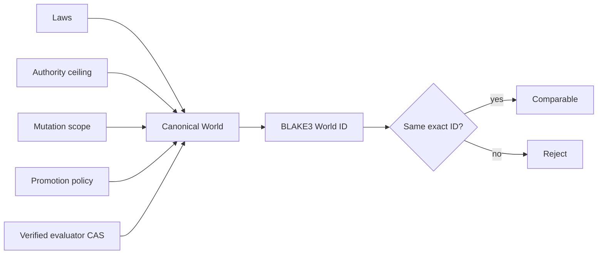

# Worlds

A World is the versioned root of evaluation semantics. Its content-derived identity includes Laws, the authority ceiling, mutation scope, promotion policy, objectives, and evaluator artifact references. Changing any normalized field creates a different World.

## Source schema

```json
{
  "schema_version": 1,
  "name": "quickstart-world",
  "laws": {
    "candidate_network": false,
    "candidate_evaluator_access": false,
    "maximum_cost_microusd": 0
  },
  "authority_ceiling": { "workspace_write": false, "network": false },
  "mutation_scope": ["harness"],
  "promotion": { "minimum_delta_bps": 0, "maximum_regressions": 0, "confidence_bps": 9500 },
  "objectives": ["correctness"],
  "evaluator_artifacts": {
    "arena.visible_manifest": "<blake3 from hephaestus arena manifest>",
    "arena.sealed_manifest": "<blake3 from hephaestus arena manifest>",
    "arena.evaluator": "<blake3 from hephaestus artifact put>",
    "arena.runtime_verifier": "<blake3 from hephaestus verifier>"
  }
}
```

| Field | Meaning |
|---|---|
| `laws` | Non-evolvable physics. `candidate_evaluator_access` must be `false`; `maximum_cost_microusd` caps every run's declared budget; `allow_mixed_environments` (optional, defaults `false`) permits a paired Arena trial to compare a parent and candidate running under two distinct execution environments (for example, a reference-worker parent against a provider-adapter candidate) — see [RUNTIMES.md](RUNTIMES.md); `auto_canary_on_drift` (optional, defaults `false`) opts this World in to the daemon's automatic drift-to-canary adaptation pipeline — see [CANARY.md](CANARY.md#automatic-drift-to-canary). |
| `authority_ceiling` | The widest capabilities any Genome in this World may request. |
| `mutation_scope` | Which targets the Forge may later change. Only `harness` compiles; `law` and `evaluator` are refused. |
| `promotion` | Deterministic policy for the future selection engine; `confidence_bps` must lie in 1–10000. |
| `objectives` | Non-blank, deduplicated, sorted. |
| `evaluator_artifacts` | Name to BLAKE3 address map. The four `arena.*` names are required for `hephaestus arena evaluate`; a World without them still supports `hephaestus run`. |

Register it with `hephaestus world register <file>`. `examples/quickstart/world.template.json` is this file with placeholders that `scripts/quickstart.sh` fills in from the addresses the daemon prints.

### Task manifests

`arena.visible_manifest` and `arena.sealed_manifest` point at canonical task manifests. Author them as ordinary JSON and let `hephaestus arena manifest <file>` canonicalize and store them:

```json
{
  "schema_version": 1,
  "manifest_id": "quickstart-visible-v1",
  "visibility": "visible",
  "tasks": [
    { "task_id": "inventory-visible", "input": "Inventory the repository without modifying it.", "expected_output": "{\"answer\":\"unknown\"}" }
  ]
}
```

Visible tasks may be shown to a candidate (inputs only, never `expected_output`); sealed tasks are evaluator-only. The exact-match evaluator compares a run's output bytes to `expected_output`.

## Compilation contract

The schema 1 compiler rejects candidate evaluator access, mutation scopes containing Laws or evaluators, confidence outside 1 through 10,000 basis points, empty or blank objectives, and missing or corrupted evaluator artifacts. It sorts and deduplicates mutation targets and objectives before producing canonical JSON and `hephaestus:world:<blake3>`.

The compiled World retains that normalized, already-authorized mutation scope for future trusted Forge enforcement. The read-only `mutation_scope()` view does not grant mutation authority to a candidate; protected Law and evaluator targets remain impossible to compile into the World.

Evaluator artifacts are verified through the same content-addressed store used by Genomes. Candidates receive identities and policy outcomes, never evaluator bytes or hidden scoring internals.

The current measurement Arena reserves four evaluator artifact names in a compiled World: `arena.visible_manifest`, `arena.sealed_manifest`, `arena.evaluator`, and `arena.runtime_verifier`. It hashes manifest bytes and requires each hash to equal the corresponding World commitment, then rehydrates only supported, expected-visibility, byte-exact canonical manifests. The verifier artifact contains the 32-byte Ed25519 public key authorized to attest runtime results; the signing seed remains daemon-only. `arena.evaluator` commits the exact executable bytes used by the process-backed exact-match evaluator; any different executable identity fails closed.



## Comparability

Results are directly comparable only when their compiled World identities match exactly. A name match is deliberately insufficient: changed Laws, evaluation artifacts, objectives, or promotion semantics begin a new progress line.
